## 什么是git

### git与svn的区别

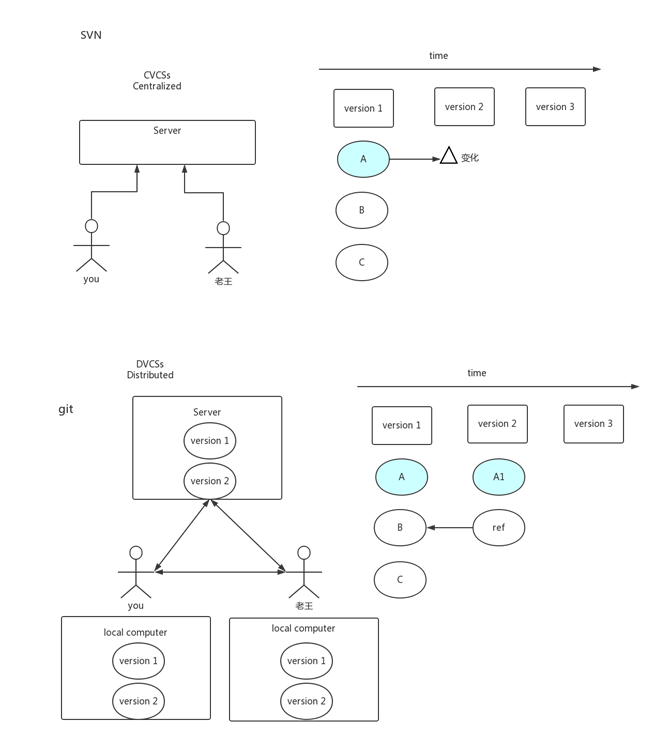

#### 问题

a)    push/pull 要联网

b)    如果server硬盘坏了 怎么办？

c)    git 保证完整性

### 安装与配置

a)    `git config –-global user.name ‘xx’`

b)   `git config –-global user.email ‘xx’`

c)    生成sshkey:

```bash
$ ssh-keygen -t rsa -C "youremail@youremail.com"  

# Generating public/private rsa key pair...
# 三次回车即可生成 ssh key
```

查看你的 public key，

```bash
$ cat ~/.ssh/id_rsa.pub
# ssh-rsa AAAAB3NzaC1yc2E... youremail@youremail.com
```

并把他添加到Gitee（gitee.com [SSHKey添加地址](http://git.oschina.net/profile/sshkeys)）或GitHub（github.com [SSHKey添加地址](https://github.com/settings/ssh/new)）

添加后，在终端中输入

```bash
#Gitee
$ ssh -T git@gitee.com

#GitHub
$ ssh -T git@github.com
```

第一次绑定的时候输入上边的代码之后会提示是否continue,输入yes后程序会自动连接，如果要求登录，直接输入登录信息即可。

再次执行上面的命令，检查是否成功连接，如果返回一下信息，则表示添加成功

```dockerfile
#Gitee``Welcome to Gitee.com, YourName!` `#GitHub``You've successfully authenticated, but GitHub does not provide shell access.
```

### git常用命令

#### git status  

没事status一下，查看当前状态

#### git remote

git clone xxxx@xxxx

把本地项目推送到远端

1. git init
2. git remote add origin xxx@xxxx
3. git push -u origin master

#### git log

通过指定提交记录哈希值的方式在 Git 中移动不太方便。在实际应用时，并没有像本程序中这么漂亮的可视化提交树供你参考，所以你就不得不用 `git log` 来查查看提交记录的哈希值。

并且哈希值在真实的 Git 世界中也会更长（译者注：基于 SHA-1，共 40 位）。比较令人欣慰的是，Git 对哈希的处理很智能。你只需要提供能够唯一标识提交记录的**前几个字符**即可。

该操作符后面可以跟一个数字（可选，不跟数字时与 `^` 相同，向上移动一次），指定向上移动多少次。

#### git checkout

1. 切换新分支
   1. 创建一个新的分支并同时切换到他`git checkout -b version-date-name`
   2. 切换分支`git checkout version-date-name`

2. 撤消更改

##### 操作符`^`和`~`

相对引用，操作符 (^)。把这个符号加在引用名称的后面，表示让 Git 寻找指定提交记录的父提交。

所以 `main^` 相当于“`main` 的父节点”。`main^^` 是 `main` 的第二个父节点。例如`git checkout main^`

如果你想在提交树中向上移动很多步的话，使用操作符 `~`。该操作符后面可以跟一个数字（可选，不跟数字时与 `^` 相同，向上移动一次），指定向上移动多少次

操作符 `^` 与 `~` 符一样，后面也可以跟一个数字。

但是该操作符后面的数字与 `~` 后面的不同，并不是用来指定向上返回几代，而是指定合并提交记录的某个父提交。当一个合并提交有两个父提交，遇到这样的节点时该选择哪条路径就不是很清晰了。

Git 默认选择合并提交的“第一个”父提交，在操作符 `^` 后跟一个数字可以改变这一默认行为。、

操作符号支持链式操作：

```bash
git checkout HEAD~^2~2
```

举例

原：


```bash
git branch bugWork main^^2^
```

现：


##### 强制修改分支位置

我使用相对引用最多的就是移动分支。可以直接使用 `-f` 选项让分支指向另一个提交。例如:

```bash
git branch -f main HEAD~3
```

上面的命令会将 main 分支强制指向 HEAD 的第 3 级父提交。

当然也可以综合使用

```bash
git branch -f bugFix main~3
```

这句命令结果是使得bugFix分支退到main的第三个父节点

#### git merge

分支的合并。推荐在远端进行合并，保证本地的master最为干净

#### git rebase

第二种合并分支的方法是 `git rebase`。Rebase 实际上就是取出一系列的提交记录，“复制”它们，然后在另外一个地方逐个的放下去。

Rebase 的优势就是可以创造更线性的提交历史，这听上去有些难以理解。如果只允许使用 Rebase 的话，代码库的提交历史将会变得异常清晰。

**少用**，掌握不好容易出问题。场景：github往别人提交版本时

#### git tag 版本

tag可以（在某种程度上 —— 因为标签可以被删除后重新在另外一个位置创建同名的标签）永久地将某个特定的提交命名为里程碑，然后就可以像分支一样引用了。

更难得的是，它们并不会随着新的提交而移动。你也不能检出到某个标签上面进行修改提交，它就像是提交树上的一个锚点，标识了某个特定的位置。

原：

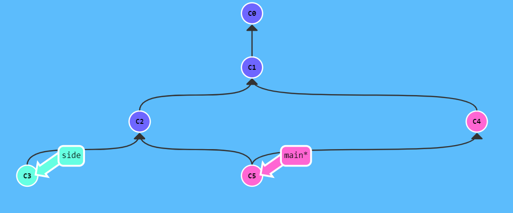

```bash
git tag v1 side~1
git tag v0 main~2
git checkout v1
```

现：

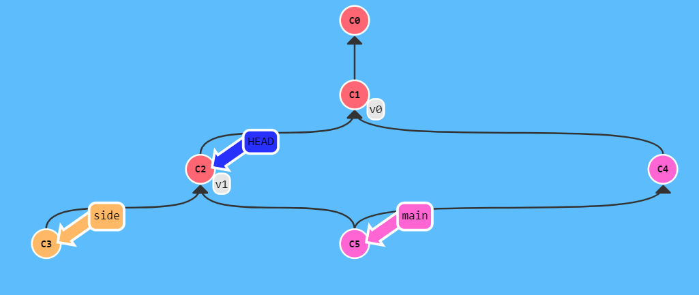

#### git describe

由于标签在代码库中起着“锚点”的作用，Git 还为此专门设计了一个命令用来**描述**离你最近的锚点（也就是标签），它就是 `git describe`！

Git Describe 能帮你在提交历史中移动了多次以后找到方向；当你用 `git bisect`（一个查找产生 Bug 的提交记录的指令）找到某个提交记录时，或者是当你坐在你那刚刚度假回来的同事的电脑前时， 可能会用到这个命令。

`git describe` 的语法是：

```bash
git describe <ref>
```

`<ref>` 可以是任何能被 Git 识别成提交记录的引用，如果你没有指定的话，Git 会以你目前所检出的位置（`HEAD`）。

它输出的结果是这样的：

```bash
<tag>_<numCommits>_g<hash>
```

`tag` 表示的是离 `ref` 最近的标签， `numCommits` 是表示这个 `ref` 与 `tag` 相差有多少个提交记录， `hash` 表示的是你所给定的 `ref` 所表示的提交记录哈希值的前几位。

当 `ref` 提交记录上有某个标签时，则只输出标签名称

#### git stash

对于这一次的操作先“入栈”，然后一次性commit。不推荐，容易乱，容易忘，会漏掉。可以使用`git commit --amend`修正，就只会是一次commit

#### git alias 组合命令

通过`git config` 文件来轻松地为每一个命令设置一个别名，这里有一些例子你可以试试：

```bash
git config --global alias.co checkout
git config --global alias.br branch
git config --global alias.ci commit
git config --global alias.st status
git config --global alias.ac '!git add -A && git commit -m'

```

这意味着，当要输入 `git commit`时，只需要输入 `git ci`。

在创建你认为应该存在的命令时这个技术会很有用。 例如，为了解决取消暂存文件的易用性问题，可以向 Git 中添加你自己的取消暂存别名：

```bash
git config --global alias.unstage 'reset HEAD --'
```

　这会使下面的两个命令等价：

```bash
git unstage fileA
git reset HEAD -- fileA
```

　　通常也会添加一个 `last` 命令，像这样：

```bash
$ git config --global alias.last 'log -1 HEAD'
# 这样，可以轻松地看到最后一次提交：
$ git last
commit 66938dae3329c7aebe598c2246a8e6af90d04646
Author: Josh Goebel <dreamer3@example.com>
Date:   Tue Aug 26 19:48:51 2008 +0800

    test for current head

    Signed-off-by: Scott Chacon <schacon@example.com>
```

　　可以看出，Git 只是简单地将别名替换为对应的命令。 然而，你可能想要执行外部命令，而不是一个 Git 子命令。 如果是那样的话，可以在命令前面加入 `!` 符号。 如果你自己要写一些与 Git 仓库协作的工具的话，那会很有用。 我们现在演示将 `git visual` 定义为 `gitk` 的别名：

```bash
git config --global alias.visual '!gitk'
```

还有取消别名，重命名等。

#### git flow

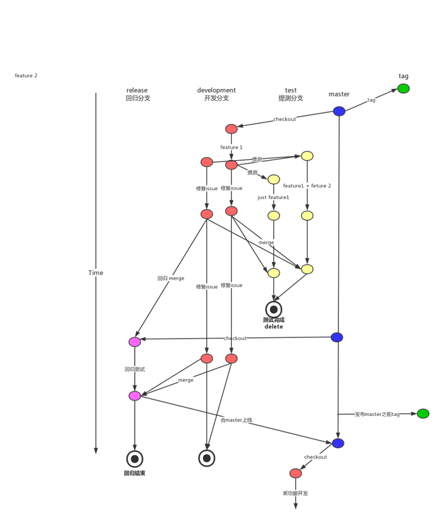

#### git branch

Git 的分支也非常轻量。它们只是简单地指向某个提交纪录 —— 仅此而已。所以许多 Git 爱好者传颂：

**早建分支！多用分支！**

这是因为即使创建再多的分支也不会造成储存或内存上的开销，并且按逻辑分解工作到不同的分支要比维护那些特别臃肿的分支简单多了。

在将分支和提交记录结合起来后，我们会看到两者如何协作。现在只要记住使用分支其实就相当于在说：“我想基于这个提交以及它所有的父提交进行新的工作。”

#### 整理提交记录

##### git cherry-pick

命令形式为:

- `git cherry-pick <提交号>...`

如果你想将一些提交复制到当前所在的位置（`HEAD`）下面的话， Cherry-pick 是最直接的方式

原：

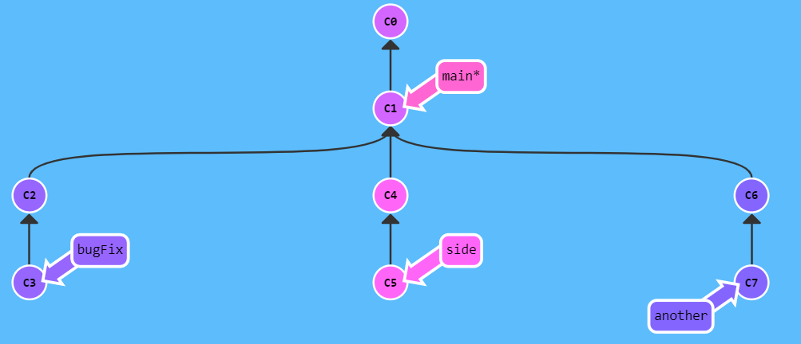

```bash
git cherry-pick c3 c4 c7
```

现：

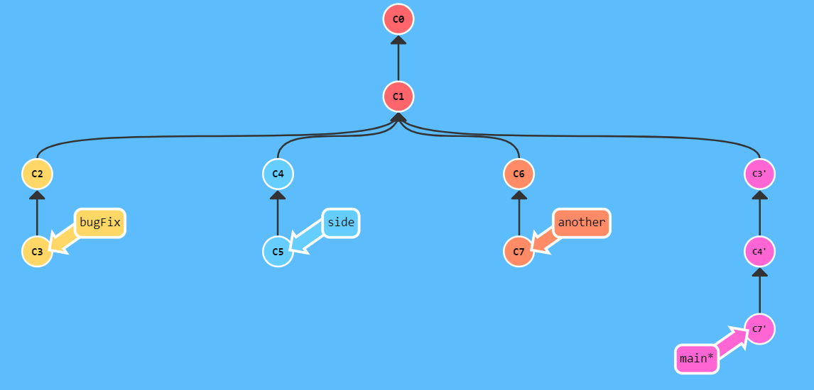

##### 交互式的rebase

如果你不清楚你想要的提交记录的哈希值，我们可以利用交互式的 rebase —— 如果你想从一系列的提交记录中找到想要的记录。

交互式 rebase 指的是使用带参数 `--interactive` 的 rebase 命令, 简写为 `-i`

如果你在命令后增加了这个选项, Git 会打开一个 UI 界面并列出将要被复制到目标分支的备选提交记录，它还会显示每个提交记录的哈希值和提交说明，提交说明有助于你理解这个提交进行了哪些更改。

在实际使用时，所谓的 UI 窗口一般会在文本编辑器 —— 如 Vim —— 中打开一个文件。

当 rebase UI界面打开时, 你能做3件事:

- 调整提交记录的顺序（通过鼠标拖放来完成）
- 删除你不想要的提交（通过切换 `pick` 的状态来完成，关闭就意味着你不想要这个提交记录）
- 合并提交。

原：

```bash
git rebase -i overHere --solution-ordering C3,C5,C4
```

现：

#### 本地栈式提交

原：


```bash
git rebase -i main --solution-ordering C4
git rebase bugFix main
```

现：


#### 撤销变更

和提交一样，撤销变更由底层部分（暂存区的独立文件或者片段）和上层部分（变更到底是通过哪种方式被撤销的）组成。我们主要关注后者。

主要有两种方法用来撤销变更 —— 一是 `git reset`，还有就是 `git revert`。

##### git reset

`git reset` 通过把分支记录回退几个提交记录来实现撤销改动。你可以将这想象成“改写历史”。`git reset` 向上移动分支，原来指向的提交记录就跟从来没有提交过一样。

Git 把 main 分支移回到 `C1`；现在我们的本地代码库根本就不知道有 `C2` 这个提交了。但在reset后， `C2` 所做的变更还在，但是处于未加入暂存区状态。


##### git revert

虽然在你的本地分支中使用 `git reset` 很方便，但是这种“改写历史”的方法对大家一起使用的远程分支是无效的哦！

为了撤销更改并**分享**给别人，我们需要使用 `git revert`。


在我们要撤销的提交记录后面多了一个新提交，这是因为新提交记录 `C2'` 引入了**更改** —— 这些更改刚好是用来撤销 `C2` 这个提交的。也就是说 `C2'` 的状态与 `C1`是相同的。

revert 之后就可以把你的更改推送到远程仓库与别人分享啦。

当然也可以对当前的版本直接进行revert

```bash
git revert HEAD
```

结果是：


#### 远程仓库

远程仓库并不复杂, 在如今的云计算盛行的世界很容易把远程仓库想象成一个富有魔力的东西, 但实际上它们只是你的仓库在另个一台计算机上的拷贝。你可以通过因特网与这台计算机通信 —— 也就是增加或是获取提交记录

话虽如此, 远程仓库却有一系列强大的特性

- 首先也是最重要的的点, 远程仓库是一个强大的备份。本地仓库也有恢复文件到指定版本的能力, 但所有的信息都是保存在本地的。有了远程仓库以后，即使丢失了本地所有数据, 你仍可以通过远程仓库拿回你丢失的数据。
- 还有就是, 远程让代码社交化了! 既然你的项目被托管到别的地方了, 你的朋友可以更容易地为你的项目做贡献(或者拉取最新的变更)

##### git clone

在我们的本地仓库多了一个名为 `o/main` 的分支, 这种类型的分支就叫**远程**分支。由于远程分支的特性导致其拥有一些特殊属性。

远程分支反映了远程仓库(在你上次和它通信时)的**状态**。这会有助于你理解本地的工作与公共工作的差别 —— 这是你与别人分享工作成果前至关重要的一步.

远程分支有一个特别的属性，在你检出时自动进入分离 HEAD 状态。Git 这么做是出于不能直接在这些分支上进行操作的原因, 你必须在别的地方完成你的工作, （更新了远程分支之后）再用远程分享你的工作成果。

###### 为什么有 `o/`？

你可能想问这些远程分支的前面的 `o/` 是什么意思呢？好吧, 远程分支有一个命名规范 —— 它们的格式是:

- `<remote name>/<branch name>`

因此，如果你看到一个名为 `o/main` 的分支，那么这个分支就叫 `main`，远程仓库的名称就是 `o`。

大多数的开发人员会将它们主要的远程仓库命名为 `origin`，并不是 `o`。这是因为当你用 `git clone` 某个仓库时，Git 已经帮你把远程仓库的名称设置为 `origin` 了

不过 `origin` 对于我们的 UI 来说太长了，因此不得不使用简写 `o` :) 但是要记住, 当你使用真正的 Git 时, 你的远程仓库默认为 `origin`!

`o/main` 只有在远程仓库中相应的分支更新了以后才会更新。

##### git fetch

`git fetch` 完成了仅有的但是很重要的两步:

- 从远程仓库下载本地仓库中缺失的提交记录
- 更新远程分支指针(如 `o/main`)

`git fetch` 实际上将本地仓库中的远程分支更新成了远程仓库相应分支最新的状态。

远程分支反映了远程仓库在你**最后一次与它通信时**的状态，`git fetch` 就是你与远程仓库通信的方式

**`git fetch` 并不会改变你本地仓库的状态**。它不会更新你的 `main` 分支，也不会修改你磁盘上的文件。

理解这一点很重要，因为许多开发人员误以为执行了 `git fetch` 以后，他们本地仓库就与远程仓库同步了。它可能已经将进行这一操作所需的所有数据都下载了下来，但是**并没有**修改你本地的文件。你可以将 `git fetch` 的理解为单纯的下载操作。

##### git pull

其实有很多方法的 —— 当远程分支中有新的提交时，你可以像合并本地分支那样来合并远程分支。也就是说就是你可以执行以下命令:

- `git cherry-pick o/main`
- `git rebase o/main`
- `git merge o/main`
- 等等

实际上，由于先抓取更新再合并到本地分支这个流程很常用，因此 Git 提供了一个专门的命令来完成这两个操作

 `git pull` 就是 git fetch 和 git merge 的缩写！他们有着同样的结果。

##### git push

`git push` 负责将**你的**变更上传到指定的远程仓库，并在远程仓库上合并你的新提交记录。

**注意 —— `git push` 不带任何参数时的行为与 Git 的一个名为 `push.default` 的配置有关。它的默认值取决于你正使用的 Git 的版本**

##### 特殊情况—基于项目**旧版**的代码

你的工作变成了基于项目**旧版**的代码，与远程仓库最新的代码不匹配。因为这情况（历史偏离）有许多的不确定性，Git 是不会允许你 `push` 变更的。实际上它会强制你先合并远程最新的代码，然后才能分享你的工作。

方法1：

```bash
git fetch
git rebase o/main
git push
```

我们用 `git fetch` 更新了本地仓库中的远程分支，然后用 rebase 将我们的工作移动到最新的提交记录下，最后再用 `git push` 推送到远程仓库。

简写：

```bash
git pull --rebase
git push
```

方法2：

尽管 `git merge` 不会移动你的工作（它会创建新的合并提交），但是它会告诉 Git 你已经合并了远程仓库的所有变更。这是因为远程分支现在是你本地分支的祖先，也就是说你的提交已经包含了远程分支的所有变化。

```bash
git fetch
git merge o/main
git push
```

我们用 `git fetch` 更新了本地仓库中的远程分支，然后**合并**了新变更到我们的本地分支（为了包含远程仓库的变更），最后我们用 `git push` 把工作推送到远程仓库

##### 特殊情况—远程服务器拒绝!(Remote Rejected)

如果你是在一个大的合作团队中工作, 很可能是master被锁定了, 需要一些Pull Request流程来合并修改。如果你直接提交(commit)到本地master, 然后试图推送(push)修改, 你将会收到这样类似的信息:

`! [远程服务器拒绝] main -> main (TF402455: 不允许推送(push)这个分支; 你必须使用pull request来更新这个分支.)`

远程服务器拒绝直接推送(push)提交到master, 因为策略配置要求 pull requests 来提交更新.

你应该按照流程,新建一个分支, 推送(push)这个分支并申请pull request,但是你忘记并直接提交给了master.现在你卡住并且无法推送你的更新.

解决办法：

新建一个分支feature, 推送到远程服务器. 然后reset你的master分支和远程服务器保持一致, 否则下次你pull并且他人的提交和你冲突的时候就会有问题.

原：

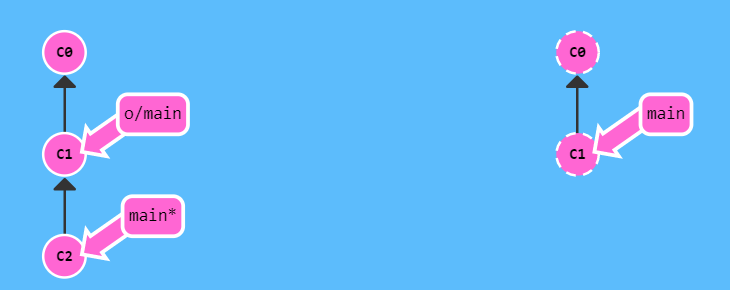

```bash
git reset --hard o/main
git checkout -b feature c2
git push origin feature
```

现：

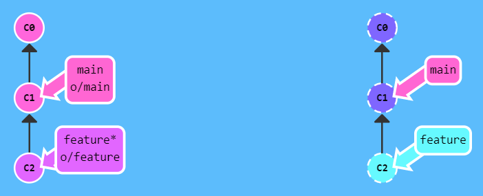

#### 远程仓库高级操作

##### 合并特性分支

```bash
git pull --rebase
git push
```

我们执行了两个命令:

- 将我们的工作 rebase 到远程分支的最新提交记录
- 向远程仓库推送我们的工作

示例：

原：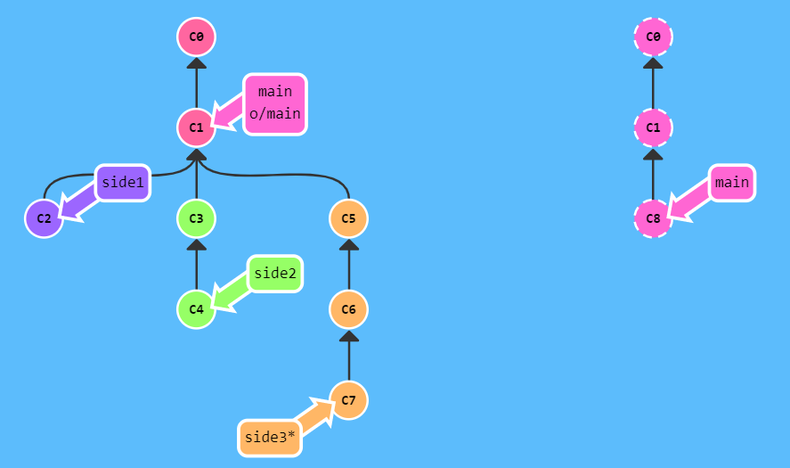

```bash
git fetch
git rebase o/main side1
git rebase side1 side2
git rebase side2 side3
git rebase side3 main
git push
```

现：

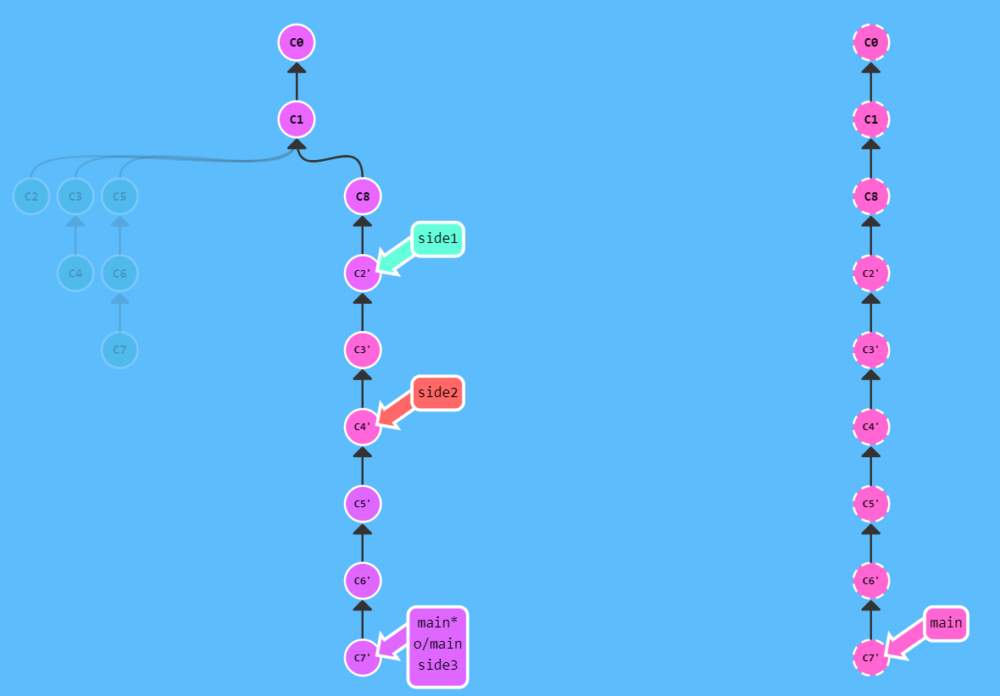

##### 合并远程仓库

在开发社区里，有许多关于 merge 与 rebase 的讨论。以下是关于 rebase 的优缺点：

优点:

- Rebase 使你的提交树变得很干净, 所有的提交都在一条线上

缺点:

- Rebase 修改了提交树的历史

比如, 提交 C1 可以被 rebase 到 C3 之后。这看起来 C1 中的工作是在 C3 之后进行的，但实际上是在 C3 之前。

一些开发人员喜欢保留提交历史，因此更偏爱 merge。而其他人（比如我自己）可能更喜欢干净的提交树，于是偏爱 rebase。仁者见仁，智者见智。

原：

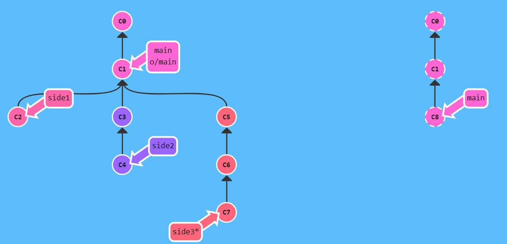

```bash
git checkout main
git pull
git merge side1
git merge side2
git merge side3
git push
```

现：

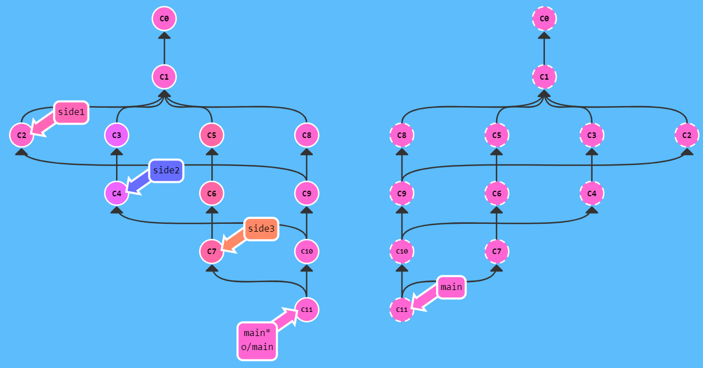

##### 远程追踪

直接了当地讲，`main` 和 `o/main` 的关联关系就是由分支的“remote tracking”属性决定的。`main` 被设定为跟踪 `o/main`—— 这意味着为 `main` 分支指定了推送的目的地以及拉取后合并的目标。

你可能想知道 `main` 分支上这个属性是怎么被设定的，你并没有用任何命令指定过这个属性呀！好吧, 当你克隆仓库的时候, Git 就自动帮你把这个属性设置好了。

当你克隆时, Git 会为远程仓库中的每个分支在本地仓库中创建一个远程分支（比如 `o/main`）。然后再创建一个跟踪远程仓库中活动分支的本地分支，默认情况下这个本地分支会被命名为 `main`。

克隆完成后，你会得到一个本地分支（如果没有这个本地分支的话，你的目录就是“空白”的），但是可以查看远程仓库中所有的分支（如果你好奇心很强的话）。这样做对于本地仓库和远程仓库来说，都是最佳选择。

这也解释了为什么会在克隆的时候会看到下面的输出：

```
local branch "main" set to track remote branch "o/main"
```

你可以让任意分支跟踪 `o/main`, 然后该分支会像 `main` 分支一样得到隐含的 push 目的地以及 merge 的目标。 这意味着你可以在分支 `totallyNotMain` 上执行 `git push`，将工作推送到远程仓库的 `main` 分支上。

有两种方法设置这个属性

第一种就是通过远程分支检出一个新的分支，执行:

```bash
git checkout -b totallyNotMain o/main
```

就可以创建一个名为 `totallyNotMain` 的分支，它跟踪远程分支 `o/main`。

第二种方法。另一种设置远程追踪分支的方法就是使用：`git branch -u` 命令，执行：

```bash
git branch -u o/main foo
```

这样 `foo` 就会跟踪 `o/main` 了。如果当前就在 foo 分支上, 还可以省略 foo：

```bash
git branch -u o/main
```

原：

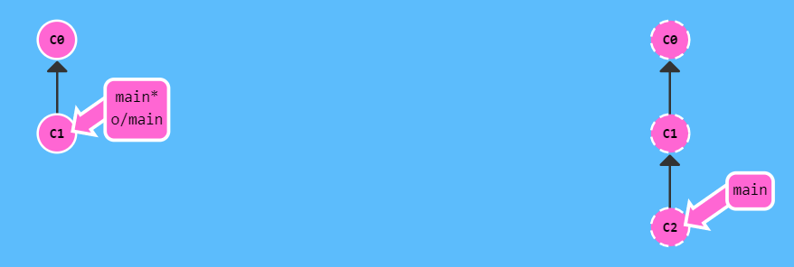

```bash
git checkout -b side o/main
git commit
git pull --rebase
git push
```

现：

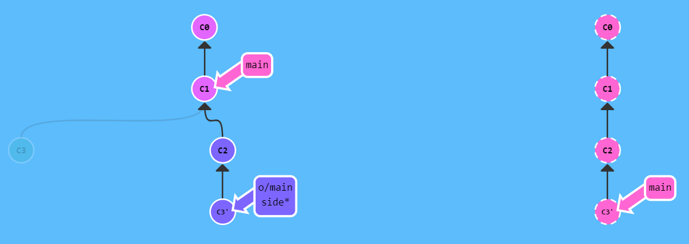

##### git push 的参数

我们可以为 push 指定参数，语法是：

```
git push <remote> <place>
```

例如：

```
git push origin main
```

把这个命令翻译过来就是：

*切到本地仓库中的“main”分支，获取所有的提交，再到远程仓库“origin”中找到“main”分支，将远程仓库中没有的提交记录都添加上去，搞定之后告诉我。*

我们通过“place”参数来告诉 Git 提交记录来自于 main, 要推送到远程仓库中的 main。它实际就是要同步的两个仓库的位置。

需要注意的是，因为我们通过指定参数告诉了 Git 所有它需要的信息, 所以它就忽略了我们所检出的分支的属性！

原：

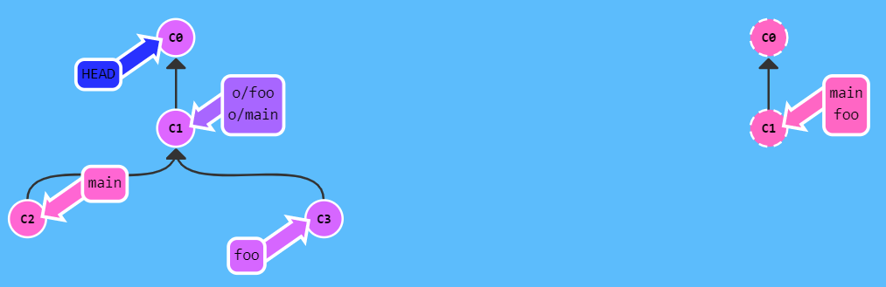

```bash
git push origin main
git push origin foo
```

现：

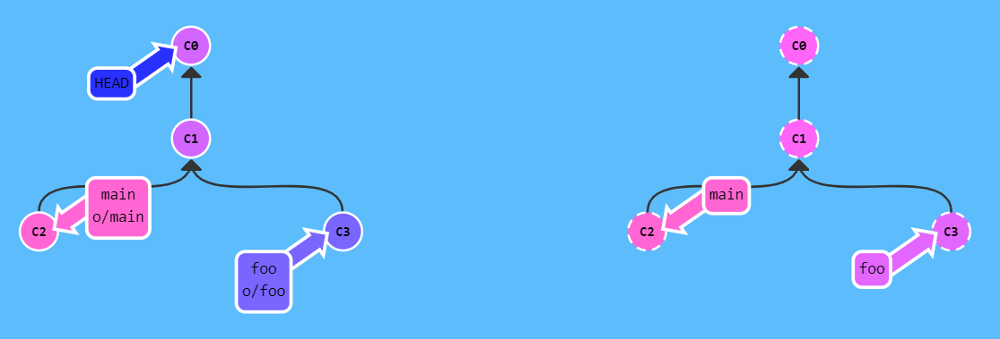

当为 git push 指定 place 参数为 `main` 时，我们同时指定了提交记录的来源和去向。

如果来源和去向分支的名称不同，要同时为源和目的地指定 `<place>` 的话，只需要用冒号 `:` 将二者连起来就可以了：

```bash
git push origin <source>:<destination>
```

这个参数实际的值是个 refspec，“refspec” 是一个自造的词，意思是 Git 能识别的位置（比如分支 `foo` 或者 `HEAD~1`）

一旦你指定了独立的来源和目的地，就可以组织出言简意赅的远程操作命令

如果你要推送到的目的分支不存在，Git 会在远程仓库中根据你提供的名称帮你创建这个分支！

原：

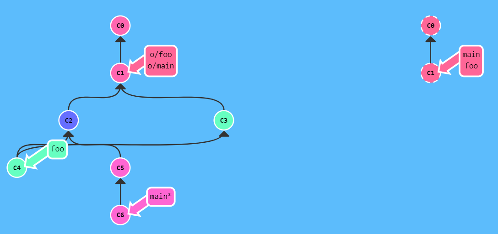

```bash
git push origin foo:main
git push origin main^:foo
```

现：

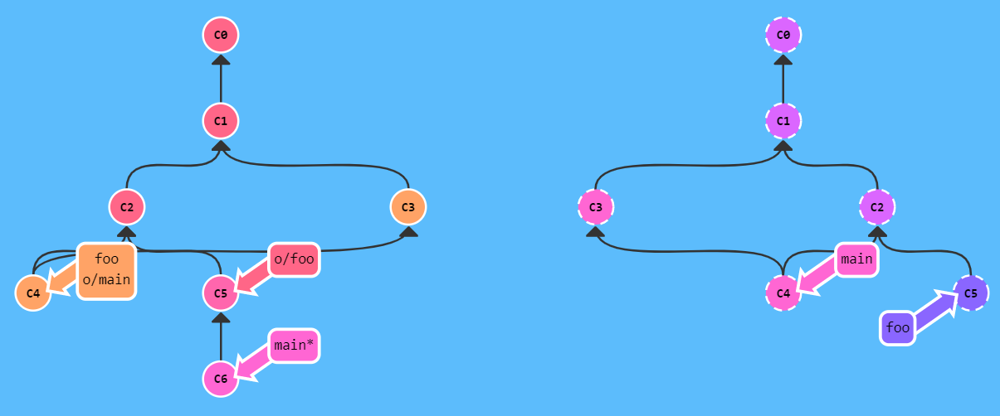

##### git fetch 的参数

`git fetch` 的参数和 `git push` 极其相似。他们的概念是相同的，只是方向相反罢了（因为现在你是下载，而非上传）

举例：如果你像如下命令这样为 git fetch 设置 的话：

```
git fetch origin foo
```

Git 会到远程仓库的 `foo` 分支上，然后获取所有本地不存在的提交，放到本地的 `o/foo` 上。

如果你觉得直接更新本地分支很爽，那你就用冒号分隔的 refspec 吧。不过，你不能在当前检出的分支上干这个事，但是其它分支是可以的。

这里有一点是需要注意的 —— `source` 现在指的是远程仓库中的位置，而 `<destination>` 才是要放置提交的本地仓库的位置。它与 git push 刚好相反，这是可以讲的通的，因为我们在往相反的方向传送数据。

理论上虽然行的通，但开发人员很少这么做。我在这里介绍它主要是为了从概念上说明 `fetch` 和 `push` 的相似性，只是方向相反罢了。

如果执行命令前目标分支不存在，跟 git push 一样，Git 会在 fetch 前自己创建立本地分支, 就像是 Git 在 push 时，如果远程仓库中不存在目标分支，会自己在建立一样。

如果 `git fetch` 没有参数，它会下载所有的提交记录到各个远程分支

前：

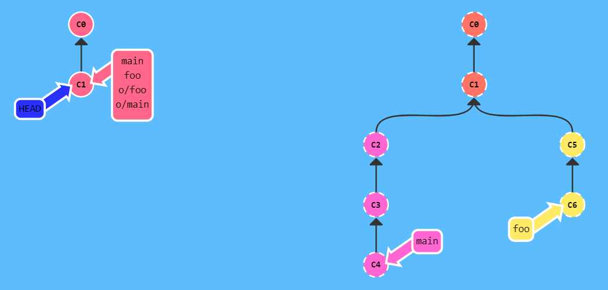

```bash
git fetch origin foo:main
git fetch origin main^:foo
#也可以git fetch origin main~1:foo
git checkout foo
git merge main
```

后：

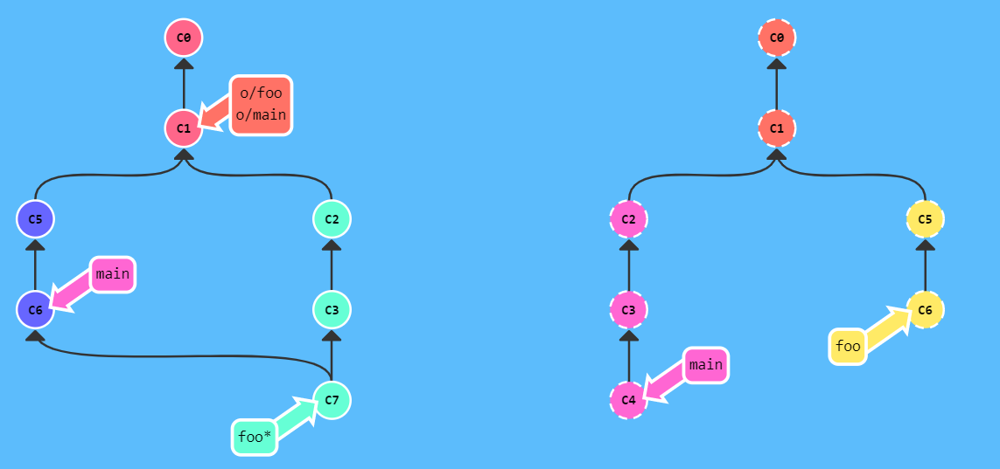

##### 没有source的source

Git 有两种关于 `<source>` 的用法是比较诡异的，即你可以在 git push 或 git fetch 时不指定任何 `source`，方法就是仅保留冒号和 destination 部分，source 部分留空。

- `git push origin :side`
- `git fetch origin :bugFix`

如果 push 空 到远程仓库，它会删除远程仓库中的分支！

如果 fetch 空 到本地，会在本地创建一个新分支。

原：

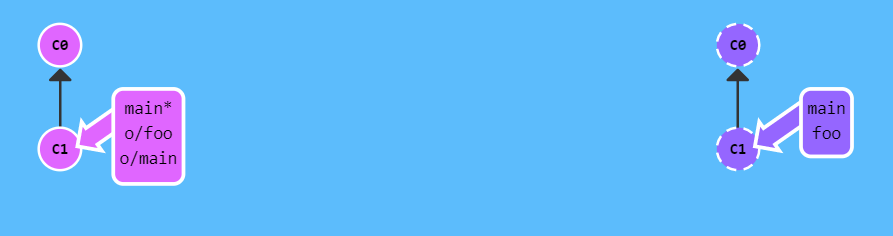

```bash
git push origin :foo
git fetch origin :bar
```

现：

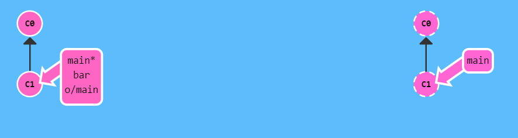

##### git pull的参数

git pull 到头来就是 fetch 后跟 merge 的缩写。你可以理解为用同样的参数执行 git fetch，然后再 merge 你所抓取到的提交记录。

以下命令在 Git 中是等效的:

`git pull origin foo` 相当于：

```
git fetch origin foo; git merge o/foo
```

还有...

`git pull origin bar~1:bugFix` 相当于：

```
git fetch origin bar~1:bugFix; git merge bugFix
```

git pull 实际上就是 fetch + merge 的缩写, git pull 唯一关注的是提交最终合并到哪里（也就是为 git fetch 所提供的 destination 参数）

原：

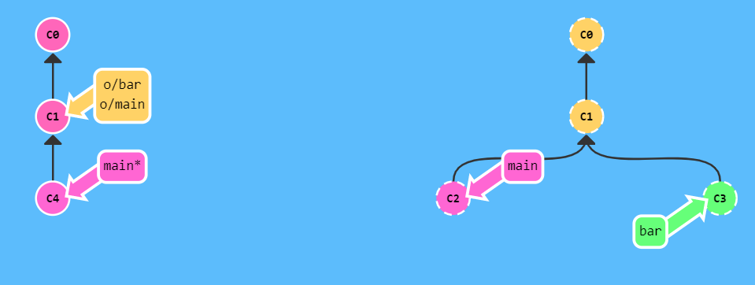

```bash
git pull origin bar:foo
git pull origin main:side
```

现：

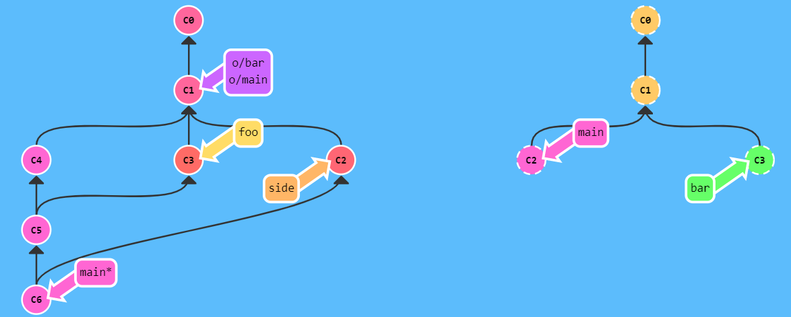

## git config

git查看配置

```shell
git config --local  --list
git config --global  --list
```

全局代理


目前在 Windows 10 上使用 Clash

```shell
git config --global http.proxy socks5://127.0.0.1:7890
git config --global https.proxy socks5://127.0.0.1:7890
```
如果只想对某个地址进行代理，比如对 github.com 代理，就这样：

```shell
git config --global http.https://github.com.proxy socks5://127.0.0.1:7890
```

配置git
```shell
# 配置全局用户
$ git config --global user.name "用户名"
$ git config --global user.email "git账号"
# 配置别名
$ git config --global alias.co checkout
$ git config --global alias.ss status
$ git config --global alias.cm commit
$ git config --global alias.br branch
$ git config --global alias.rg reflog
# 这里只是美化 log 的输出，实际使用时可以在 git lg 后面加命令参数，如：git lg -10 显示最近10条提交
$ git config --global alias.lg "log --color --graph --pretty=format:'%Cred%h%Creset -%C(yellow)%d%Creset %s %Cgreen(%cr) %C(bold blue)<%an>%Creset' --abbrev-commit"
# 删除全局配置
$ git config --global --unset alias.xxx
$ git config --global --unset user.xxx
```


# Git 分支管理规范
实际开发的时候，一人一条分支（个人见解：除非是大项目，参与的开发人员很多时，可以采用 feature 分支，否则一般的项目中，一个开发者一条分支够用了）。除此之外还要有一条 develop 开发分支，一条 test 测试分支，一条 release 预发布分支。
- 「develop」：「开发分支」，开发人员每天都需要拉取/提交最新代码的分支；
- 「test」：「测试分支」，开发人员开发完并自测通过后，发布到测试环境的分支；
- 「release」：「预发布分支」，测试环境测试通过后，将测试分支的代码发布到预发环境的分支（「这个得看公司支不支持预发环境，没有的话就可以不采用这条分支」）；
- 「master」：「线上分支」，预发环境测试通过后，运营/测试会将此分支代码发布到线上环境；

大致流程：
开发人员每天都需要拉取/提交最新的代码到 「develop 分支」；
开发人员开发完毕，开始 「集成测试」，测试无误后提交到 「test 分支」并发布到测试环境，交由测试人员测试；
测试环境通过后，发布到 「release 分支」 上，进行预发环境测试；
预发环境通过后，发布到 「master 分支」上并打上标签（tag）；
如果线上分支出了 bug ，这时候相关开发者应该基于预发布分支（「没有预发环境，就使用 master 分支」），新建一个 「bug 分支」用来临时解决 bug ，处理完后申请合并到 预发布 分支。这样做的好处就是：不会影响正在开发中的功能。
「预发布环境的作用：」 预发布环境是正式发布前最后一次测试。因为在少数情况下即使预发布通过了，都不能保证正式生产环境可以100%不出问题；预发布环境的配置，数据库等都是跟线上一样；有些公司的预发布环境数据库是连接线上环境，有些公司预发布环境是单独的数据库；如果不设预发布环境，如果开发合并代码有问题，会直接将问题发布到线上，增加维护的成本。

## 添加多个远程仓库

```shell
# 查看本地仓库关联的远程仓库情况
git remote -v

git remote set-url --add origin https://gitee.com/xxxx/xxxx.git

$ git remote -v
origin  https://github.com/xxxx/xxxx.git (fetch)
origin  https://github.com/xxxx/xxxx.git (push)
origin  https://gitee.com/xxxx/xxxx.git (push)
```
本地仓库可以同时推送到github和gitee，但只能从github拉取

可以通过直接修改.git/config文件来实现同样的功能

```text
# 找到remote origin，添加url = 仓库地址
[remote "origin"]
        url = https://github.com/xxxx/xxxx.git
        fetch = +refs/heads/*:refs/remotes/origin/*
        url = https://gitee.com/xxxx/xxxx.git
```

如果有冲突，解决完或者强制
git push -f origin1 dev git push -f origin2 dev
