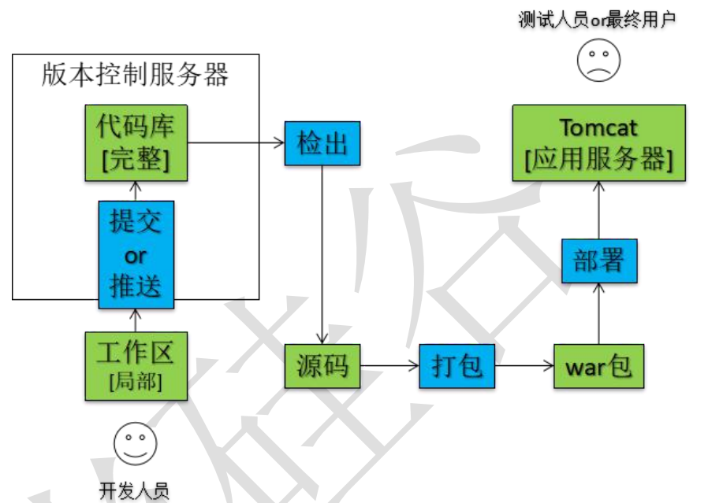
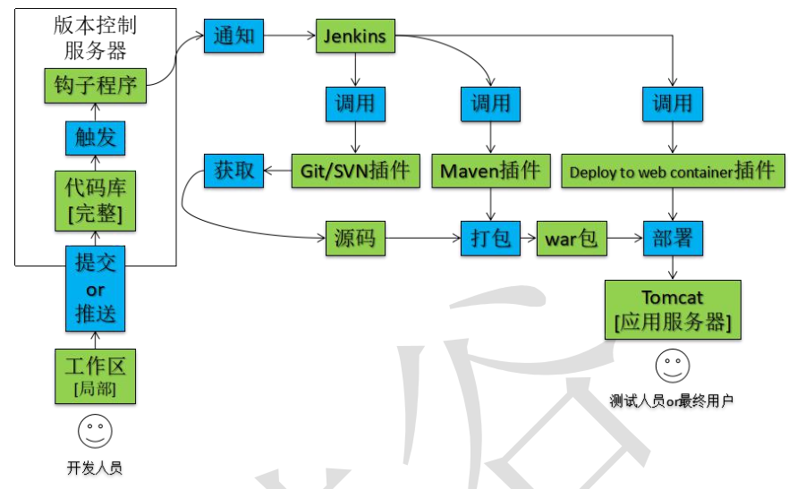

# jenkins

## 认识Jenkins

### 持续部署

- 装修厨房
  全部装好之后发现灯不亮，电路有问题；冷热水装反了，管路有问题。这些问
  题要解决就必须把地砖、墙砖拆掉——一个环节有问题，其他环节跟着返工。
  那怎么做会好一些呢？
  任何安装完成及时测试，确保其可以正常工作。

- 项目开发
  开发过程中进行单元测试能够通过，但是部署到服务器上运行出现问题。
  那怎么做会好一些呢？
  仅仅单元测试还不够，各个模块都必须能够在服务器上运行。

- 关注点
  持续部署的关注点在于项目功能**部署至服务器后可以运行**，为下一步测试环节
  或最终用户正式使用做好准备。

### Continuous integration 持续集成

- 装修厨房
  装修厨房时我们需要铺地砖，如果把所有地砖都切好再拿去铺就会发现：每一
  块地砖单独看都是好的，但是实际铺的时候，把所有地砖整合起来，发现和厨房
  地面总体尺寸不匹配，边边角角的地砖需要重新切，时间和物料成本陡然升高。
  那怎么做会好一些呢？
  切一块铺一块，根据需要的尺寸来切，尽早发现尺寸变化，避免返工。

- 项目开发
  各个小组分别负责各个具体模块开发，本模块独立测试虽然能够通过，但是上
  线前夕将所有模块整合到一起集成测试却发现很多问题，想要解决就需要把很多代
  码返工重写而且仍然有可能有问题，但现在时间很可能不够了。
  那怎么做会好一些呢？
  **经常性、频繁的把所有模块集成在一起进行测试**，有问题尽早发现，这就是持
  续集成。

- 关注点
  持续集成的关注点在于尽早发现项目整体运行问题，尽早解决。

### Continuous Delivery   持续交付

- 装修厨房
  全部装修好之后房屋主人来验收，各项功能都正常，但是水龙头的样式主人不
  喜欢，灶台的位置主人不满意，要求返工。

  那怎么做会好一些呢？
  房屋主人随时查看装修进度，施工团队及时调整。

- 项目开发
  项目的各个升级版本之间间隔时间太长，对用户反馈感知迟钝，无法精确改善
  用户体验，用户流失严重。
  那怎么做会好一些呢？
  用**小版本不断进行快速迭代**，不断收集用户反馈信息，用最快的速度改进优化。

- 关注点
  持续交付的关注点在于研发团队的最新代码能够尽快让最终用户体验到。

c)  Java写的

## JavaEE 项目部署方式对比

手动部署

自动化部署

“自动化”的具体体现：向版本库提交新的代码后，应用服务器上自动部署，用户或测试人员使用的马上就是最新的应用程序。

搭建上述持续集成环境可以把整个构建、部署过程自动化，很大程度上减轻工作量。
对于程序员的日常开发来说不会造成任何额外负担——自己把代码提交上去之后，服务
器上运行的马上就是最新版本——一切都发生在无形中。

## 安装

https://jenkins.io/download/

Java -jar xxx.jar --port 8089

## 配置

a)  全局配置

