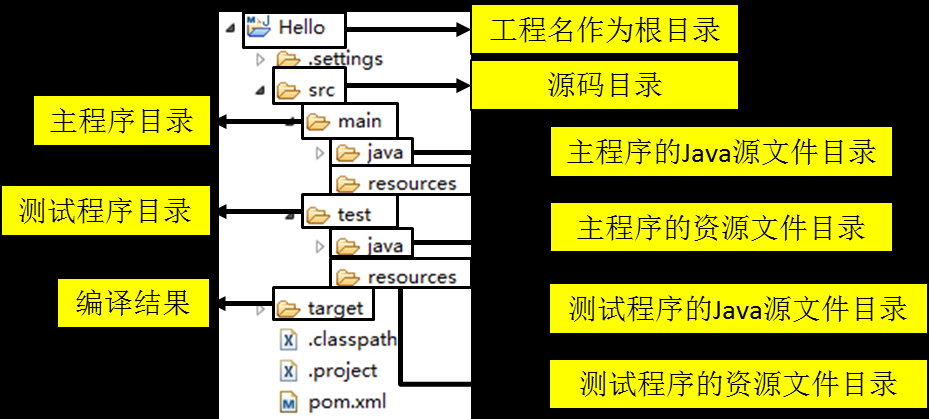
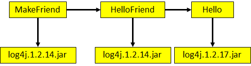
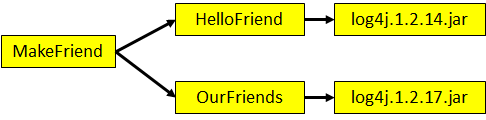
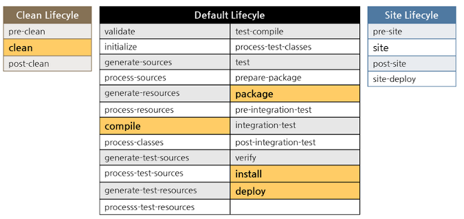
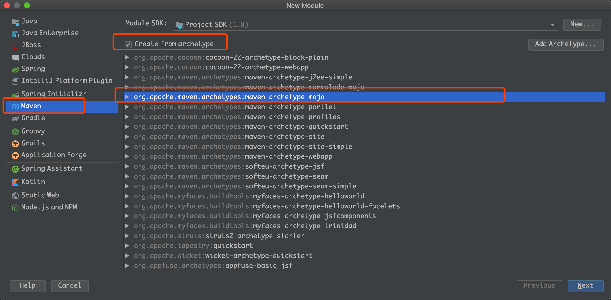

# Maven

## 下载

#### 下载安装

<https://maven.apache.org/download.cgi>

#### 配置 MVM_HOME

1. Windows path

2. Linux .bash_profile

3. MAVEN_OPTS，以一个变量的形式传值

5. 配置setting.xml

maven加载顺序——> `~/.m2/setting.ml`——> `conf/setting.ml`

```html
镜像配置
<mirror>  
	<id>alimaven</id>  
	<name>aliyun maven</name>  
	<url>http://maven.aliyun.com/nexus/content/groups/public/</url>  
	<mirrorOf>central</mirrorOf>          
</mirror> 

<mirror>
	<id>ui</id>
	<mirrorOf>central</mirrorOf>
	<name>Human Readable Name for this Mirror.</name>
	<url>http://uk.maven.org/maven2/</url>
</mirror>

<mirror>
	<id>osc</id>
	<mirrorOf>central</mirrorOf>
	<url>http://maven.oschina.net/content/groups/public/</url>
</mirror>

<mirror>
	<id>osc_thirdparty</id>
	<mirrorOf>thirdparty</mirrorOf>
	<url>http://maven.oschina.net/content/repositories/thirdparty/</url>
</mirror>

```

### Maven项目

##### pom.xml

```html
<modelVersion>4.0.0</modelVersion>

<groupId>org.example</groupId>
<artifactId>firstMavenTest</artifactId>
<packaging>pom</packaging>
<version>1.0-SNAPSHOT</version>
```

- groupId  倒着写的域名

- artfactId 功能命名

- version 版本号（定义的好坏影响沟通成本）

- packaging  打包方式 **默认是jar**，还有pom，maven-plugin

`<dependencyManagement>`

1. 只能出现在父pom

2. 统一版本号

3. 声明 (子POM里用到再引)

`<Dependency>`

1. Type 默认jar

2. scope-优化使用范围

   a)    compile 编译  例如spring-core

   b)    test 测试

   c)    provided编译 例如 servlet

   d)    runtime运行时 例如JDBC驱动实现

   e)    system 本地一些jar  例如短信jar

### 版本管理

#### a)    1.0-SNAPSHOT

​      i.     repository 删除

​     ii.     mvn clean package -U (强制拉一次)

#### b)    主版本号.次版本号.增量版本号-<里程碑版本>

如1.0.0-RELAESE


	
### Maven核心概念

#### 目录结构



#### POM

#### 坐标

#### 依赖

##### 1.依赖的传递性

非 compile的依赖不能传递，有需要就重复的进行声明依赖

scope的依赖传递（非重点）：

|          | compile  | test | provided | runtime  |
| -------- | -------- | ---- | -------- | -------- |
| compile  | compile  | -    | -        | runtime  |
| test     | test     | -    | -        | test     |
| provided | provided | -    | provided | provided |
| runtime  | runtime  | -    | -        | runtime  |

##### 2.依赖的排除  

情景：如果我们在当前工程中引入了一个依赖是 A，而 A 又依赖了 B，那么 Maven 会自动将 A 依赖的 B 引入当前工程，但是个别情况下 B 有可能是一个不稳定版，或对当前工程有不良影响。这时我们可以在引入 A 的时候将 B 排除。

```html
<dependency>
    <groupId>com.atguigu.maven</groupId>
    <artifactId>HelloFriend</artifactId>
    <version>0.0.1-SNAPSHOT</version>
    <type>jar</type>
    <scope>compile</scope>
    <exclusions>
        <exclusion>
        <groupId>commons-logging</groupId>
        <artifactId>commons-logging</artifactId>
        </exclusion>
    </exclusions>
</dependency>
```

##### 3.依赖的原则（依赖仲裁）

作用：解决jar包的冲突

1. 路径最短者优先
   
   
   
2. 路径相同时先声明者优先（“声明”的先后顺序指的是 dependency 标签配置的先后顺序）

   

##### 4.统一管理依赖的文本

【1】统一声明版本号

```html
<properties>
	<atguigu.spring.version>4.1.1.RELEASE</atguigu.spring.version>
</properties>
```

其中的atguigu.spring.version 部分是自定义标签

【2】在依赖声明里面版本的位置引用前面的版本号

```html
<dependencies>
    <dependency>
        <groupId>org.springframework</groupId>
        <artifactId>spring-core</artifactId>
        <version>${atguigu.spring.version}</version>
	</dependency>
……
</dependencies>
```

当然标签的用法可以推广到很多地方

```html
<properties>
	<project.build.sourceEncoding>UTF-8</project.build.sourceEncoding>
</properties>
```

#### 生命周期

Maven 生命周期定义了各个构建环节的执行顺序，有了这个清单，Maven 就可以自动化的执行构建命
令

Maven 有三套相互独立的生命周期，分别是：
	①Clean Lifecycle 在进行真正的构建之前进行一些清理工作。
	②Default Lifecycle 构建的核心部分，编译，测试，打包，安装，部署等等。
	③Site Lifecycle 生成项目报告，站点，发布站点。
它们是相互独立的，你可以仅仅调用 clean 来清理工作目录，仅仅调用 site 来生成站点。当然你也可以
直接运行 mvn clean install site 运行所有这三套生命周期。

A Build Lifecycle is Made Up of Phases
A Build Phase is Made Up of Plugin Goals
**每套生命周期都由一组阶段(Phase)组成，我们平时在命令行输入的命令总会对应于一个特定的阶段。**比如，运行 mvn clean，这个 clean 是 Clean 生命周期的一个阶段。有 Clean 生命周期，也有 clean 阶段。

##### clean生命周期

Clean 生命周期一共包含了三个阶段：
	①pre-clean 执行一些需要在 clean 之前完成的工作
	②clean 移除所有上一次构建生成的文件
	③post-clean 执行一些需要在 clean 之后立刻完成的工作

##### Site 生命周期

①pre-site 执行一些需要在生成站点文档之前完成的工作
②site 生成项目的站点文档
③post-site 执行一些需要在生成站点文档之后完成的工作，并且为部署做准备
④site-deploy 将生成的站点文档部署到特定的服务器上
这里经常用到的是 site 阶段和 site-deploy 阶段，用以生成和发布 Maven 站点，这可是 Maven 相当强大
的功能，Manager 比较喜欢，文档及统计数据自动生成，很好看。

##### Default 生命周期



###### 常用命令

clean 删除target/
process-resources 复制并处理资源文件，至目标目录，准备打包。
compile 编译项目的源代码。
process-test-resources 复制并处理资源文件，至目标测试目录。
test-compile 编译测试源代码。
test 使用合适的单元测试框架运行测试。这些测试代码不会被打包或部署。
package 接受编译好的代码，打包成可发布的格式，如 JAR。
install 将包安装至本地仓库，以让其它项目依赖（把项目install到local repo）。
deploy 将最终的包复制到远程的仓库，以让其它开发人员与项目共享或部署到服务器上运行（发本地jar发布到remote）。

**运行任何一个阶段的时候，它前面的所有阶段都会被运行**

#### 仓库

#### 插件和目标

- Maven 的核心仅仅定义了抽象的生命周期，具体的任务都是交由插件完成的。
- 每个插件都能实现多个功能，每个功能就是一个插件目标。
- Maven 的生命周期与插件目标相互绑定，以完成某个具体的构建任务。

例如：compile 就是插件 maven-compiler-plugin 的一个目标；pre-clean 是插件 maven-clean-plugin 的一个目标。

##### 常用插件

a)    常用插件

 https://maven.apache.org/plugins/ 

 http://www.mojohaus.org/plugins.html 

findbugs 静态代码检查，针对字节码做操作

versions 统一升级版本号

​			mvn versions:set -DnewVersion=1.1

source 打包源代码，一般在内部使用环境

assembly 打包zip、war

tomcat7

##### 自定义插件

IDEA有内置骨架




a)  改变pom的`<packaging>maven-plugin</packaging>`

添加依赖

```html
<dependencies>
        <dependency>
            <groupId>org.apache.maven</groupId>
            <artifactId>maven-plugin-api </artifactId>
            <version>3.5.0</version>
        </dependency>
        <dependency>
            <groupId>org.apache.maven.plugin-tools</groupId>
            <artifactId>maven-plugin-annotations</artifactId>
            <version>3.5</version>
            <scope>provided</scope>
        </dependency>
    </dependencies>
```

b)  `extends AbstractMojo`

生成的类继承了 AbstractMojo 这个抽象类，这里是 maven 插件的规范要求，maven 插件必须要继承 AbstractMojo 并实现他的 execute 方法

c）插件编写

```java
import org.apache.maven.plugin.AbstractMojo;
import org.apache.maven.plugin.MojoExecutionException;
import org.apache.maven.plugin.MojoFailureException;
import org.apache.maven.plugins.annotations.LifecyclePhase;
import org.apache.maven.plugins.annotations.Mojo;

@Mojo(name = "liantest", defaultPhase = LifecyclePhase.PACKAGE)
public class MyMojo extends AbstractMojo {
    public void execute() throws MojoExecutionException, MojoFailureException {
        System.out.println("first plugin!!");
    }
}
```

a)  `mvn clean install`

b)  参数传递

在我们想使用插件的项目中添加配置，其中 plugin 中使用我们插件的GAV信息。

```java
<build>
    <plugins>
        <plugin>
            <groupId>.......</groupId>
            <artifactId>......</artifactId>
            <version>.......</version>
        </plugin>
    </plugins>
</build>
```


注：我们的自定义plugin可以通过绑定挂载到对应的phase来运行，如果不做任何操作，那么将不会自主运行

#### 继承

由于非 compile 范围的依赖信息是不能在“依赖链”中传递的，所以有需要的工程只能单独配置。

使用继承机制就可以将这样的依赖信息统一提取到父工程模块中进行统一管理。

步骤：

【1】创建一个父工程。打包方式为pom

【2】在子工程声明对父工程的引用

```html
<parent>
    <groupId>com.atguigu.maven</groupId>
    <artifactId>Parent</artifactId>
    <version>0.0.1-SNAPSHOT</version>
    
    <!-- 指定从当前子工程的pom.xml文件出发，查找父工程的pom.xml的路径 -->
    <relativePath>../Parent/pom.xml</relativePath>
</parent>
```


【3】将子工程的坐标中与父工程坐标中重复的内容删除

【4】在父工程中统一管理junit的依赖

将 Parent 项目中的 dependencies 标签，用 `<dependencyManagement> `标签括起来

```html
<dependencyManagement>
    <dependencies>
        <dependency>
            <groupId>junit</groupId>
            <artifactId>junit</artifactId>
            <version>4.9</version>
            <scope>test</scope>
        </dependency>
    </dependencies>
</dependencyManagement>
```

【5】在子工程中删除junit依赖的版本号部分,重新指定需要的依赖，删除范围和版本号

```html
<dependencies>
    <dependency>
        <groupId>junit</groupId>
        <artifactId>junit</artifactId>
    </dependency>
</dependencies>
```

**配置继承之后，执行安装命令需要先安装父工程**


#### 聚合

将多个工程拆分为模块后，需要手动逐个安装到仓库后依赖才能够生效。修改源码后也需要逐个手动进
行 clean 操作。而使用了聚合之后就可以批量进行 Maven 工程的安装、清理工作。

如何配置
在总的聚合工程中使用 modules/module 标签组合，指定模块工程的相对路径即可

```html
<modules>
    <module>../Hello</module>
    <module>../HelloFriend</module>
    <module>../MakeFriends</module>
</modules>
```

使用方法：在聚合工程的pom.xml进行maven install

在聚合里面的module顺序不影响结果