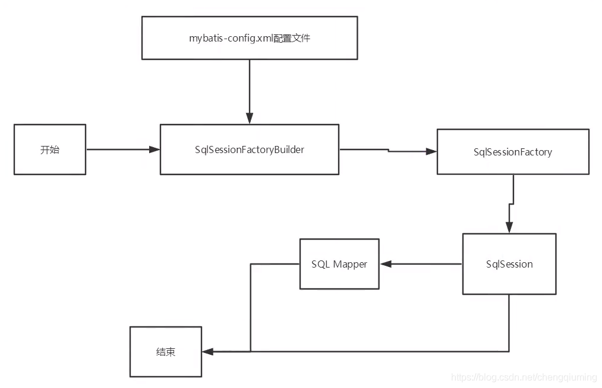
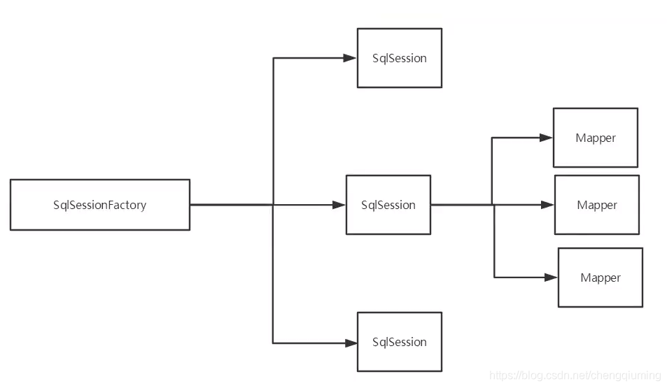
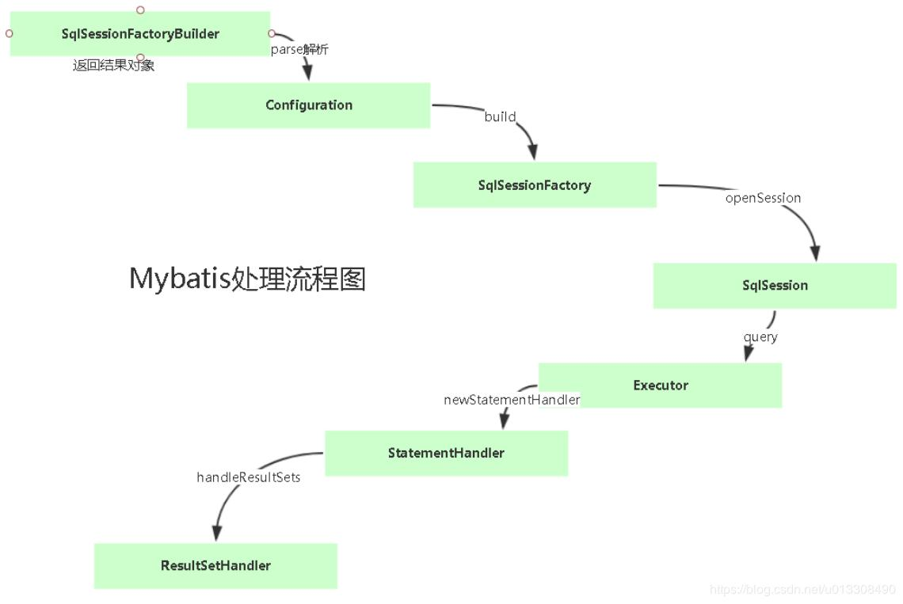

# Mybatis

## 持久化

数据持久化

- 持久化就是将程序的数据在持久状态和瞬时状态转化的过程
- 内存:断电即失

- 数据库(Jdbc), io文件持久化。

- 生活:冷藏.罐头。

为什么需要持久化?

- 有一些对象，不能让他丢掉。
- 内存太贵了

## 持久层

Dao层，Service层， Controller层...

- 完成持久化工作的代码块
- 层界限十分明显。


## 为什么需要MyBatis

帮助程序猿将数据存入到数据库中。
方便
传统的JDBC代码太复杂了。简化。框架。自动化。
不用Mybatis也可以。更容易上手。技术没有高低之分
优点:

- 简单易学
- 灵活
- sql和代码的分离，提高了可维护性。
- 提供映射标签,支持对象与数据库的orm字段关系映射
- 提供对象关系映射标签，支持对象关系组建维护
- 提供xml标签, 支持编写动态sql。


## 第一个MyBatis

### 搭建数据库

### 创建一个模块

#### 编写配置

```xml
<?xml version="1.0" encoding="UTF-8" ?>
<!DOCTYPE configuration
        PUBLIC "-//mybatis.org//DTD Config 3.0//EN"
        "http://mybatis.org/dtd/mybatis-3-config.dtd">

<!--核心配置文件-->
<configuration>
    <environments default="development">
        <environment id="development">
            <transactionManager type="JDBC"/>
            <dataSource type="POOLED">
                <property name="driver" value="com.mysql.cj.jdbc.Driver"/>
                <property name="url" value="jdbc:mysql://localhost/school?serverTimezone=UTC&amp;useUnicode=true&amp;characterEncoding=utf8&amp;useSSL=true"/>
                <property name="username" value="root"/>
                <property name="password" value="123456"/>
            </dataSource>
        </environment>
    </environments>


</configuration>
```

编写工具类


### 编写代码

- 实体类
- Dao接口

```java
public interface UserDao {
    List<User> getUserList();
}
```

- 接口实现类由原来的userDaolmpl转变为一个mapper对象


### 测试

注意点报错原因

```
org.apache.ibatis.binding.BindingException: Type interface com.lian.dao.UserDao is not known to the MapperRegistry.
```

解决方法：

maven由于他的约定大于配置，我们之后遇见我们写的配置文件，无法被导出或者生效的问题，解决方案：

```xml
<resources>
      <resource>
        <directory>src/main/java</directory>
        <includes>
          <include>**/*.xml</include>
        </includes>
      </resource>
      <resource>
        <directory>src/main/resources</directory>
        <includes>
          <include>*.xml</include>
        </includes>
      </resource>
</resources>
```


遇见报错

```java
D:\Java\jdk-11.0.9\bin\java.exe -ea -Didea.test.cyclic.buffer.size=1048576 "-javaagent:D:\JetBrains\IntelliJ IDEA 2020.3.1\lib\idea_rt.jar=6063:D:\JetBrains\IntelliJ IDEA 2020.3.1\bin" -Dfile.encoding=UTF-8 -classpath "D:\JetBrains\IntelliJ IDEA 2020.3.1\lib\idea_rt.jar;D:\JetBrains\IntelliJ IDEA 2020.3.1\plugins\junit\lib\junit5-rt.jar;D:\JetBrains\IntelliJ IDEA 2020.3.1\plugins\junit\lib\junit-rt.jar;D:\IdeaProjects\MyBatisStudy\mybatis01\target\test-classes;D:\IdeaProjects\MyBatisStudy\mybatis01\target\classes;D:\Java\maven_repository\org\mybatis\mybatis\3.5.6\mybatis-3.5.6.jar;D:\Java\maven_repository\junit\junit\4.13.1\junit-4.13.1.jar;D:\Java\maven_repository\org\hamcrest\hamcrest-core\1.3\hamcrest-core-1.3.jar;D:\Java\maven_repository\mysql\mysql-connector-java\8.0.23\mysql-connector-java-8.0.23.jar;D:\Java\maven_repository\com\google\protobuf\protobuf-java\3.11.4\protobuf-java-3.11.4.jar;D:\Java\maven_repository\commons-dbcp\commons-dbcp\1.4\commons-dbcp-1.4.jar;D:\Java\maven_repository\commons-pool\commons-pool\1.5.4\commons-pool-1.5.4.jar" com.intellij.rt.junit.JUnitStarter -ideVersion5 com.lian.dao.UserDaoTest,test

java.lang.ExceptionInInitializerError
	at com.lian.dao.UserDaoTest.test(UserDaoTest.java:15)
	at java.base/jdk.internal.reflect.NativeMethodAccessorImpl.invoke0(Native Method)
	at java.base/jdk.internal.reflect.NativeMethodAccessorImpl.invoke(NativeMethodAccessorImpl.java:62)
	at java.base/jdk.internal.reflect.DelegatingMethodAccessorImpl.invoke(DelegatingMethodAccessorImpl.java:43)
	at java.base/java.lang.reflect.Method.invoke(Method.java:566)
	at org.junit.runners.model.FrameworkMethod$1.runReflectiveCall(FrameworkMethod.java:59)
	at org.junit.internal.runners.model.ReflectiveCallable.run(ReflectiveCallable.java:12)
	at org.junit.runners.model.FrameworkMethod.invokeExplosively(FrameworkMethod.java:56)
	at org.junit.internal.runners.statements.InvokeMethod.evaluate(InvokeMethod.java:17)
	at org.junit.runners.ParentRunner$3.evaluate(ParentRunner.java:306)
	at org.junit.runners.BlockJUnit4ClassRunner$1.evaluate(BlockJUnit4ClassRunner.java:100)
	at org.junit.runners.ParentRunner.runLeaf(ParentRunner.java:366)
	at org.junit.runners.BlockJUnit4ClassRunner.runChild(BlockJUnit4ClassRunner.java:103)
	at org.junit.runners.BlockJUnit4ClassRunner.runChild(BlockJUnit4ClassRunner.java:63)
	at org.junit.runners.ParentRunner$4.run(ParentRunner.java:331)
	at org.junit.runners.ParentRunner$1.schedule(ParentRunner.java:79)
	at org.junit.runners.ParentRunner.runChildren(ParentRunner.java:329)
	at org.junit.runners.ParentRunner.access$100(ParentRunner.java:66)
	at org.junit.runners.ParentRunner$2.evaluate(ParentRunner.java:293)
	at org.junit.runners.ParentRunner$3.evaluate(ParentRunner.java:306)
	at org.junit.runners.ParentRunner.run(ParentRunner.java:413)
	at org.junit.runner.JUnitCore.run(JUnitCore.java:137)
	at com.intellij.junit4.JUnit4IdeaTestRunner.startRunnerWithArgs(JUnit4IdeaTestRunner.java:69)
	at com.intellij.rt.junit.IdeaTestRunner$Repeater.startRunnerWithArgs(IdeaTestRunner.java:33)
	at com.intellij.rt.junit.JUnitStarter.prepareStreamsAndStart(JUnitStarter.java:220)
	at com.intellij.rt.junit.JUnitStarter.main(JUnitStarter.java:53)
Caused by: org.apache.ibatis.exceptions.PersistenceException: 
### Error building SqlSession.
### Cause: org.apache.ibatis.builder.BuilderException: Error creating document instance.  Cause: org.xml.sax.SAXParseException; lineNumber: 6; columnNumber: 5; 1 字节的 UTF-8 序列的字节 1 无效。
	at org.apache.ibatis.exceptions.ExceptionFactory.wrapException(ExceptionFactory.java:30)
	at org.apache.ibatis.session.SqlSessionFactoryBuilder.build(SqlSessionFactoryBuilder.java:80)
	at org.apache.ibatis.session.SqlSessionFactoryBuilder.build(SqlSessionFactoryBuilder.java:64)
	at com.lian.utils.MyBatisUtils.<clinit>(MyBatisUtils.java:19)
	... 26 more
Caused by: org.apache.ibatis.builder.BuilderException: Error creating document instance.  Cause: org.xml.sax.SAXParseException; lineNumber: 6; columnNumber: 5; 1 字节的 UTF-8 序列的字节 1 无效。
	at org.apache.ibatis.parsing.XPathParser.createDocument(XPathParser.java:263)
	at org.apache.ibatis.parsing.XPathParser.<init>(XPathParser.java:127)
	at org.apache.ibatis.builder.xml.XMLConfigBuilder.<init>(XMLConfigBuilder.java:82)
	at org.apache.ibatis.session.SqlSessionFactoryBuilder.build(SqlSessionFactoryBuilder.java:77)
	... 28 more
Caused by: org.xml.sax.SAXParseException; lineNumber: 6; columnNumber: 5; 1 字节的 UTF-8 序列的字节 1 无效。
	at java.xml/com.sun.org.apache.xerces.internal.util.ErrorHandlerWrapper.createSAXParseException(ErrorHandlerWrapper.java:204)
	at java.xml/com.sun.org.apache.xerces.internal.util.ErrorHandlerWrapper.fatalError(ErrorHandlerWrapper.java:178)
	at java.xml/com.sun.org.apache.xerces.internal.impl.XMLErrorReporter.reportError(XMLErrorReporter.java:400)
	at java.xml/com.sun.org.apache.xerces.internal.impl.XMLErrorReporter.reportError(XMLErrorReporter.java:306)
	at java.xml/com.sun.org.apache.xerces.internal.impl.XMLDocumentScannerImpl$PrologDriver.next(XMLDocumentScannerImpl.java:1000)
	at java.xml/com.sun.org.apache.xerces.internal.impl.XMLDocumentScannerImpl.next(XMLDocumentScannerImpl.java:605)
	at java.xml/com.sun.org.apache.xerces.internal.impl.XMLDocumentFragmentScannerImpl.scanDocument(XMLDocumentFragmentScannerImpl.java:534)
	at java.xml/com.sun.org.apache.xerces.internal.parsers.XML11Configuration.parse(XML11Configuration.java:888)
	at java.xml/com.sun.org.apache.xerces.internal.parsers.XML11Configuration.parse(XML11Configuration.java:824)
	at java.xml/com.sun.org.apache.xerces.internal.parsers.XMLParser.parse(XMLParser.java:141)
	at java.xml/com.sun.org.apache.xerces.internal.parsers.DOMParser.parse(DOMParser.java:246)
	at java.xml/com.sun.org.apache.xerces.internal.jaxp.DocumentBuilderImpl.parse(DocumentBuilderImpl.java:339)
	at org.apache.ibatis.parsing.XPathParser.createDocument(XPathParser.java:261)
	... 31 more
Caused by: com.sun.org.apache.xerces.internal.impl.io.MalformedByteSequenceException: 1 字节的 UTF-8 序列的字节 1 无效。
	at java.xml/com.sun.org.apache.xerces.internal.impl.io.UTF8Reader.invalidByte(UTF8Reader.java:702)
	at java.xml/com.sun.org.apache.xerces.internal.impl.io.UTF8Reader.read(UTF8Reader.java:568)
	at java.xml/com.sun.org.apache.xerces.internal.impl.XMLEntityScanner.load(XMLEntityScanner.java:1904)
	at java.xml/com.sun.org.apache.xerces.internal.impl.XMLEntityScanner.scanData(XMLEntityScanner.java:1377)
	at java.xml/com.sun.org.apache.xerces.internal.impl.XMLScanner.scanComment(XMLScanner.java:800)
	at java.xml/com.sun.org.apache.xerces.internal.impl.XMLDocumentFragmentScannerImpl.scanComment(XMLDocumentFragmentScannerImpl.java:1069)
	at java.xml/com.sun.org.apache.xerces.internal.impl.XMLDocumentScannerImpl$PrologDriver.next(XMLDocumentScannerImpl.java:883)
	... 39 more


Process finished with exit code -1

```

出现这个问题的原因很简单，是没有设置idea的编码为utf-8从而导致xml的中文注释乱码，只要将idea的 ***\*File Encoding\**** 全设置为utf-8即可（记得maven先clean一下）。

当然为了避免之后的问题可以在里面把默认的编码也改为utf-8.


### 从 SqlSessionFactory 中获取 SqlSession

既然有了 SqlSessionFactory，顾名思义，我们可以从中获得 SqlSession 的实例。SqlSession 提供了在数据库执行 SQL 命令所需的所有方法。你可以通过 SqlSession 实例来直接执行已映射的 SQL 语句。例如：

```java
try (SqlSession session = sqlSessionFactory.openSession()) {
  Blog blog = (Blog) session.selectOne("org.mybatis.example.BlogMapper.selectBlog", 101);
}
```

诚然，这种方式能够正常工作，对使用旧版本 MyBatis 的用户来说也比较熟悉。但现在有了一种更简洁的方式——使用和指定语句的参数和返回值相匹配的接口（比如 BlogMapper.class），现在你的代码不仅更清晰，更加类型安全，还不用担心可能出错的字符串字面值以及强制类型转换。

例如：

```java
try (SqlSession session = sqlSessionFactory.openSession()) {
  BlogMapper mapper = session.getMapper(BlogMapper.class);
  Blog blog = mapper.selectBlog(101);
}
```


## CRUD

### namespace

namespace中的包名字要和 Dao/mapper 接口的包一致

### select

id：就是对应的namespace中的方法名
resultType：Sql语句执行的返回值
parameterType：参数类型


步骤：

1、编写接口

```java
package com.lian.dao;

import com.lian.Pojo.User;

import java.util.List;

public interface UserMapper {
    //查询全部用户
    List<User> getUserList();

    //根据id查询用户
    User getUserId(int id);

    //insert one user
    int addUser(User user);

    //update
    int updateUser(User user);

    //delete
    int deleteUser(int id);

}

```


2、编写对应mapper中的sql语句

```xml
<?xml version="1.0" encoding="UTF-8" ?>
<!DOCTYPE mapper
        PUBLIC "-//mybatis.org//DTD Mapper 3.0//EN"
        "http://mybatis.org/dtd/mybatis-3-mapper.dtd">

<!--namespace=会绑定一个对应的Mapper接口-->
<mapper namespace="com.lian.dao.UserMapper">

    <!--select查询语句-->
    <select id="getUserList" resultType="com.lian.Pojo.User">
        select * from mybatis.user
    </select>

    <select id="getUserId" parameterType="int" resultType="com.lian.Pojo.User">
        select * from mybatis.user where id = #{id}
    </select>

    <!--对象中的属性，可以直接取出来-->
    <insert id="addUser" parameterType="com.lian.Pojo.User">
        insert into mybatis.user(id, name, pwd) VALUES(#{id}, #{name}, #{pwd})
    </insert>

    <update id="updateUser" parameterType="com.lian.Pojo.User">
        update mybatis.user
        set name = #{name}, pwd = #{pwd}
        where id = #{id};
    </update>
    
    <delete id="deleteUser" parameterType="int">
        delete from mybatis.user where id = #{id}
    </delete>
</mapper>
```


3、测试

```java
package com.lian.dao;

import com.lian.Pojo.User;
import com.lian.utils.MyBatisUtils;
import org.apache.ibatis.session.SqlSession;
import org.junit.Test;

import java.util.List;

public class UserDaoTest {

    @Test
    public void test(){
        //第一步，获得sqlSession对象
        SqlSession sqlSession = MyBatisUtils.getsqlSession();

        //方法一：getMapper
        UserMapper userMapper = sqlSession.getMapper(UserMapper.class);
        List<User> userList = userMapper.getUserList();

        //方法二：不推荐
        //sqlSession.selectList("com.lian.dao.UserDao.getUserList");

        for (User user : userList) {
            System.out.println(user);
        }

        //关闭sqlsession
        sqlSession.close();
    }

    @Test
    public void getUserById(){
        SqlSession sqlSession = MyBatisUtils.getsqlSession();
        UserMapper mapper = sqlSession.getMapper(UserMapper.class);

        User user = mapper.getUserId(1);
        System.out.println(user);

        sqlSession.close();
    }

    //增删改需要提交事务
    @Test
    public void addUser(){
        SqlSession sqlSession = MyBatisUtils.getsqlSession();
        UserMapper mapper = sqlSession.getMapper(UserMapper.class);

        int res = mapper.addUser(new User(4, "llop", "12234"));
        if (res > 0 ){
            System.out.println("insert success!");
        }

        //提交事务
        sqlSession.commit();
        sqlSession.close();
    }

    //update
    @Test
    public void updateUser(){
        SqlSession sqlSession = MyBatisUtils.getsqlSession();
        UserMapper mapper = sqlSession.getMapper(UserMapper.class);

        int res = mapper.updateUser(new User(4, "llop-change", "12234000"));
        if (res > 0 ){
            System.out.println("update success!");
        }

        //提交事务
        sqlSession.commit();
        sqlSession.close();
    }

    //delete
    @Test
    public void deleteUser(){
        SqlSession sqlSession = MyBatisUtils.getsqlSession();
        UserMapper mapper = sqlSession.getMapper(UserMapper.class);

        int res = mapper.deleteUser(4);
        if (res > 0 ){
            System.out.println("delete success!");
        }
        //提交事务
        sqlSession.commit();
        sqlSession.close();
    }
}
```


### insert

### update

### delete

### 注意点，错误点

一定要提交事务

标签不要匹配错误

resource绑定mapper，需要使用路径`\`

程序配置文件必须符合规范

空指针异常：没有注册到资源

输出的xml文件中存在中文乱码问题

maven资源xml 等没有导出的问题


## 万能map

假设，我们的实体类，或者数据库中的表，字段或者参数过多,我们应当考虑使用Map！

野路子

```java
int addUser2(Map<String, Object> map);
```

```xml
<!--map-->
    <insert id="addUser2" parameterType="map">
        insert into mybatis.user(id, name, pwd) VALUES(#{userId}, #{userName}, #{password})
    </insert>
```

```java
@Test
    public void addUser2() {
        SqlSession sqlSession = MyBatisUtils.getsqlSession();
        UserMapper mapper = sqlSession.getMapper(UserMapper.class);

        Map<String, Object> map = new HashMap<>();
        map.put("userId", 5);
        map.put("userName", "oopos");
        map.put("password", "87654");

        int res = mapper.addUser2(map);
        if (res > 0) {
            System.out.println("insert success!");
        }

        //提交事务
        sqlSession.commit();
        sqlSession.close();
    }
```

Map传递参数，直接在sql中取出key即可	 [parameterType="map"]

对象传递参数，直接在sql中取对象的属性即可	[parameterType="Object"]

只有一个基本类型参数的情况下，可以直接在sql中取到

多个参数用Map,**或者注解**


## 模糊查询

1、java代码执行的时候，传递通配符`% %`

```java
List<User> userLike = mapper.getUserLike("%s%");
```

2、在sql拼接中使用通配符

```sql
select * from mybatis.user where name like "%"#{value}"%"
```

```sql
select * from mybatis.user where name like concat('%',#{value},'%')
```


## 配置解析

MyBatis 可以配置成适应多种环境，这种机制有助于将 SQL 映射应用于多种数据库之中， 现实情况下有多种理由需要这么做。例如，开发、测试和生产环境需要有不同的配置；或者想在具有相同 Schema 的多个生产数据库中使用相同的 SQL 映射

**不过要记住：尽管可以配置多个环境，但每个 SqlSessionFactory 实例只能选择一种环境。**

### **属性（properties）**

这些属性可以在外部进行配置，并可以进行动态替换。

编写一个配置文件`db.properties`

```xml
driver = com.mysql.cj.jdbc.Driver
url =jdbc:mysql://localhost/mybatis?serverTimezone=UTC&useUnicode=true&characterEncoding=utf8&useSSL=true
username = root
password = 123456
```

在核心配置文件中映入

```xml
<properties resource="org/mybatis/example/config.properties">
    <property name="username" value="dev_user"/>
    <property name="password" value="F2Fa3!33TYyg"/>
</properties>
```

- 可以直接引入外部文件
- 还可以额外增加一些属性配置
- 如果两个文件同有一个字段，优先使用外部resource的字段

### 类型别名（typeAliases）

类型别名可为 Java 类型设置一个缩写名字。 它仅用于 XML 配置，意在降低冗余的全限定类名书写。

1、

```xml
<typeAliases>
  <typeAlias alias="Author" type="domain.blog.Author"/>
  <typeAlias alias="Blog" type="domain.blog.Blog"/>
  <typeAlias alias="Comment" type="domain.blog.Comment"/>
  <typeAlias alias="Post" type="domain.blog.Post"/>
  <typeAlias alias="Section" type="domain.blog.Section"/>
  <typeAlias alias="Tag" type="domain.blog.Tag"/>
</typeAliases>
```

2、指定一个包名，MyBatis 会在包名下面搜索需要的 Java Bean

扫描实体类的包，他的默认别名就为这个类的类名，**首字母小写**，当然要是真的大写了也是不会错的。

```xml
<typeAliases>
  <package name="domain.blog"/>
</typeAliases>
```


注：

在实体类比较少的时候，使用第一种方式。

如果实体类十分多，适合第二种方式

第一种可以自己设置别名，第二种不行但是可以加注解

优先级：`<typeAliases>` > 注解`@Alias("author")`>扫描包`<package name="domain.blog"/>`

`type="[JDBC|MANAGED]"`

### **数据源（dataSource）**

有三种内建的数据源类型（也就是 type="[UNPOOLED|POOLED|JNDI]"）


### 设置（settings）

| 设置名             | 描述                                                         | 有效值                                                       | 默认值 |
| :----------------- | :----------------------------------------------------------- | :----------------------------------------------------------- | :----- |
| cacheEnabled       | 全局性地开启或关闭所有映射器配置文件中已配置的任何缓存。     | true \| false                                                | true   |
| lazyLoadingEnabled | 延迟加载的全局开关。当开启时，所有关联对象都会延迟加载。 特定关联关系中可通过设置 `fetchType` 属性来覆盖该项的开关状态。 | true \| false                                                | false  |
| logImpl            | 指定 MyBatis 所用日志的具体实现，未指定时将自动查找。        | SLF4J \| LOG4J \| LOG4J2 \| JDK_LOGGING \| COMMONS_LOGGING \| STDOUT_LOGGING \| NO_LOGGING | 未设置 |
|                    |                                                              |                                                              |        |


### 其他配置

#### [typeHandlers（类型处理器）](https://mybatis.org/mybatis-3/zh/configuration.html#typeHandlers)

#### [objectFactory（对象工厂）](https://mybatis.org/mybatis-3/zh/configuration.html#objectFactory)

#### [plugins（插件）](https://mybatis.org/mybatis-3/zh/configuration.html#plugins)

一些插件


### 映射器（mappers）

1、【推荐】

```xml
<!-- 使用相对于类路径的资源引用 -->
<mappers>
  <mapper resource="org/mybatis/builder/AuthorMapper.xml"/>
  <mapper resource="org/mybatis/builder/BlogMapper.xml"/>
  <mapper resource="org/mybatis/builder/PostMapper.xml"/>
</mappers>
```
2、

```xml
<!-- 使用完全限定资源定位符（URL） -->
<mappers>
  <mapper url="file:///var/mappers/AuthorMapper.xml"/>
  <mapper url="file:///var/mappers/BlogMapper.xml"/>
  <mapper url="file:///var/mappers/PostMapper.xml"/>
</mappers>
```

3、使用class

```XML
<!-- 使用映射器接口实现类的完全限定类名 -->
<mappers>
  <mapper class="org.mybatis.builder.AuthorMapper"/>
  <mapper class="org.mybatis.builder.BlogMapper"/>
  <mapper class="org.mybatis.builder.PostMapper"/>
</mappers>
```
注意点：

- 接口和他的Mapper配置文件必须同名
- 接口和他的Mapper配置文件必须在同一个包下面


4、扫描包

```xml
<!-- 将包内的映射器接口实现全部注册为映射器 -->
<mappers>
  <package name="org.mybatis.builder"/>
</mappers>
```

注意点：

- 接口和他的Mapper配置文件必须同名
- 接口和他的Mapper配置文件必须在同一个包下面

练习：

- 数据库配置文件外部引入
- 实体类别名
- 保证UserMapper.xml和UserMapper接口名字一致，并且在同一个包下面（其实也可以在resourse中建立和类相同路径，这是结构底层原理）


## 作用域（Scope）和生命周期

理解我们之前讨论过的不同作用域和生命周期类别是至关重要的，因为错误的使用会导致非常严重的**并发问题**。

### SqlSessionFactoryBuilder

- 一旦创建了 SqlSessionFactory，就不再需要它了
- 局部变量

### SqlSessionFactory

- 类似数据库连接池
-  一旦被创建就应该在应用的运行期间一直存在，没有任何理由丢弃它或重新创建另一个实例
- 不要重复创建多次，多次重建 SqlSessionFactory 被视为一种代码”坏习惯“
- 最简单的就是使用单例模式或者静态单例模式

### SqlSession

- 每个线程都应该有它自己的 SqlSession 实例（连接到连接池的请求）
- SqlSession 的实例不是线程安全的，因此是不能被共享的，所以它的**最佳的作用域是请求或方法作用域**
- 用完之后需要赶紧关闭，否则资源会被占用





每一个apper代表一个具体的业务

## 结果映射：解决属性名和字段名不一致的问题

当数据库中的字段为


此时如果创建的实体类为：

```java
public class User {
    private int id;
    private String name;
    private String password;
	……
}
```

测试之后就会出现password查找为null的问题：

```java
D:\Java\jdk-11.0.9\bin\java.exe...
User{id=1, name='alice', password='null'}

Process finished with exit code 0
```

sql查询的本质实则是这两句

```sql
select * from mybatis.user where id = #{id}
select id, name, pwd from mybatis.user where id = #{id}
```

因为sql的pwd和类的password不对应所以出现了这种问题。

解决方法

1、起别名

如果列名和属性名不能匹配上，可以在 SELECT 语句中设置列别名（这是一个基本的 SQL 特性）来完成匹配。比如：

```xml
<select id="selectUsers" resultType="User">
  select
    user_id             as "id",
    user_name           as "userName",
    hashed_password     as "hashedPassword"
  from some_table
  where id = #{id}
</select>
```


### resultMap：第二种解决方式

结果集映射，你完全可以不用显式地配置它们，当然也可以显式使用外部的 `resultMap` 。==注意我们去掉了 `resultType` 属性==

```xml
<!--结果集映射-->
<resultMap id="UserMap" type="User">
    <!--column 数据库中的字段 property 实体类中的属性-->
    <result column="id" property="id"/>
    <result column="name" property="name"/>
    <result column="pwd" property="password"/>
</resultMap>

<!--by id-->
<select id="getUserById" parameterType="int" resultMap="UserMap">
    select * from mybatis.user where id = #{id}
</select>
```

`resultMap` 元素是 MyBatis 中最重要最强大的元素。它可以让你从 90% 的 JDBC `ResultSets` 数据提取代码中解放出来，并在一些情形下允许你进行一些 JDBC 不支持的操作。

ResultMap 的设计思想是，对简单的语句做到零配置，对于复杂一点的语句，只需要描述语句之间的关系就行了。

==如果这个世界总是这么简单就好了。==

### 高级结果映射


## 日志

### 日志工厂

如果一一个数据库操作，出现了异常,我们需要排错。日志就是最好的助手！
曾经： sout、 debug
现在：日志工厂！

| 设置名  | 描述                                                  | 有效值                                                       | 默认值 |
| ------- | ----------------------------------------------------- | ------------------------------------------------------------ | ------ |
| logImpl | 指定 MyBatis 所用日志的具体实现，未指定时将自动查找。 | SLF4J \| LOG4J \| LOG4J2 \| JDK_LOGGING \| COMMONS_LOGGING \| STDOUT_LOGGING \| NO_LOGGING | 未设置 |
|         |                                                       |                                                              |        |

- SLF4J
- LOG4J【掌握】
- LOG4J2
- JDK_LOGGING
- COMMONS_LOGGING
- STDOUT_LOGGING【掌握】
- NO_LOGGING

具体使用哪一个日志在settings中进行设置

```xml
<settings>
    <setting name="logImpl" value="STDOUT_LOGGING"/><!--多一个空格，大小写都会报错-->
</settings>
```


#### STDOUT_LOGGING日志输出

```java
Opening JDBC Connection
Created connection 1634723627.
Setting autocommit to false on JDBC Connection [com.mysql.cj.jdbc.ConnectionImpl@616fe72b]
==>  Preparing: select * from mybatis.user where id = ?
==> Parameters: 1(Integer)
<==    Columns: id, name, pwd
<==        Row: 1, alice, 12345
<==      Total: 1
User{id=1, name='alice', password='12345'}
Resetting autocommit to true on JDBC Connection [com.mysql.cj.jdbc.ConnectionImpl@616fe72b]
Closing JDBC Connection [com.mysql.cj.jdbc.ConnectionImpl@616fe72b]
Returned connection 1634723627 to pool.

Process finished with exit code 0
```


#### LOG4J日志输出

1、导入maven配置

```xml
<!-- https://mvnrepository.com/artifact/log4j/log4j -->
<dependency>
    <groupId>log4j</groupId>
    <artifactId>log4j</artifactId>
    <version>1.2.17</version>
</dependency>
```

2、配置文件

```xml
#将等级为DEBUG的日志信息输出到console和file这两个目的地，console和file的定义在下面的代码
log4j.rootLogger=DEBUG,console,file

#控制台输出的相关设置
log4j.appender.console = org.apache.log4j.ConsoleAppender
log4j.appender.console.Target = System.out
log4j.appender.console.Threshold=DEBUG
log4j.appender.console.layout = org.apache.log4j.PatternLayout
log4j.appender.console.layout.ConversionPattern=[%c]-%m%n

#文件输出的相关设置
log4j.appender.file = org.apache.log4j.RollingFileAppender
log4j.appender.file.File=./log/lian.log
log4j.appender.file.MaxFileSize=10mb
log4j.appender.file.Threshold=DEBUG
log4j.appender.file.layout=org.apache.log4j.PatternLayout
log4j.appender.file.layout.ConversionPattern=[%p][%d{yy-MM-dd}][%c]%m%n

#日志输出级别
log4j.logger.org.mybatis=DEBUG
log4j.logger.java.sql=DEBUG
log4j.logger.java.sql.Statement=DEBUG
log4j.logger.java.sql.ResultSet=DEBUG
log4j.logger.java.sql.PreparedStatement=DEBUG
```

```html
log4j.rootLogger=INFO,consoleAppender,logfile,MAIL
log4j.addivity.org.apache=true
#ConsoleAppender，控制台输出
#FileAppender，文件日志输出
#SMTPAppender，发邮件输出日志
#SocketAppender，Socket 日志
#NTEventLogAppender，Window NT 日志
#SyslogAppender，
#JMSAppender，
#AsyncAppender，
#NullAppender
#文件输出：RollingFileAppender
#log4j.rootLogger = INFO,logfile
log4j.appender.logfile = org.apache.log4j.RollingFileAppender
log4j.appender.logfile.Threshold = INFO
# 输出以上的 INFO 信息
log4j.appender.logfile.File = INFO_log.html
#保存 log 文件路径
log4j.appender.logfile.Append = true
# 默认为 true，添加到末尾，false 在每次启动时进行覆盖
log4j.appender.logfile.MaxFileSize = 1MB
# 一个 log 文件的大小，超过这个大小就又会生成 1 个日志 # KB ，MB，GB
log4j.appender.logfile.MaxBackupIndex = 3
# 最多保存 3 个文件备份
log4j.appender.logfile.layout = org.apache.log4j.HTMLLayout
# 输出文件的格式
log4j.appender.logfile.layout.LocationInfo = true
#是否显示类名和行数
log4j.appender.logfile.layout.Title=title:\u63d0\u9192\u60a8\uff1a\u7cfb\u7edf\u53d1\u751f\u4e86\u4e25\u91cd\u9519\u8bef
#html 页面的 < title >
############################## SampleLayout ####################################
# log4j.appender.logfile.layout = org.apache.log4j.SampleLayout
############################## PatternLayout ###################################
# log4j.appender.logfile.layout = org.apache.log4j.PatternLayout
# log4j.appender.logfile.layout.ConversionPattern =% d % p [ % c] - % m % n % d
############################## XMLLayout #######################################
# log4j.appender.logfile.layout = org.apache.log4j.XMLLayout
# log4j.appender.logfile.layout.LocationInfo = true #是否显示类名和行数
############################## TTCCLayout ######################################
# log4j.appender.logfile.layout = org.apache.log4j.TTCCLayout
# log4j.appender.logfile.layout.DateFormat = ISO8601
#NULL, RELATIVE, ABSOLUTE, DATE or ISO8601.
# log4j.appender.logfile.layout.TimeZoneID = GMT - 8 : 00
# log4j.appender.logfile.layout.CategoryPrefixing = false ##默认为 true 打印类别名
# log4j.appender.logfile.layout.ContextPrinting = false ##默认为 true 打印上下文信息
# log4j.appender.logfile.layout.ThreadPrinting = false ##默认为 true 打印线程名
# 打印信息如下：
#2007 - 09 - 13 14 : 45 : 39 , 765 [http - 8080 - 1 ] ERROR com.poxool.test.test -error 成功关闭链接
###############################################################################
#每天文件的输出：DailyRollingFileAppender
#log4j.rootLogger = INFO,errorlogfile
log4j.appender.errorlogfile = org.apache.log4j.DailyRollingFileAppender
log4j.appender.errorlogfile.Threshold = ERROR
log4j.appender.errorlogfile.File = ../logs/ERROR_log
log4j.appender.errorlogfile.Append = true
#默认为 true，添加到末尾，false 在每次启动时进行覆盖
log4j.appender.errorlogfile.ImmediateFlush = true
#直接输出，不进行缓存
# ' . ' yyyy - MM: 每个月更新一个 log 日志
# ' . ' yyyy - ww: 每个星期更新一个 log 日志
# ' . ' yyyy - MM - dd: 每天更新一个 log 日志
# ' . ' yyyy - MM - dd - a: 每天的午夜和正午更新一个 log 日志
# ' . ' yyyy - MM - dd - HH: 每小时更新一个 log 日志
# ' . ' yyyy - MM - dd - HH - mm: 每分钟更新一个 log 日志

log4j.appender.errorlogfile.DatePattern = ' . ' yyyy - MM - dd ' .log '
#文件名称的格式
log4j.appender.errorlogfile.layout = org.apache.log4j.PatternLayout
log4j.appender.errorlogfile.layout.ConversionPattern =%d %p [ %c] - %m %n %d
#控制台输出：
#log4j.rootLogger = INFO,consoleAppender
log4j.appender.consoleAppender = org.apache.log4j.ConsoleAppender
log4j.appender.consoleAppender.Threshold = ERROR
log4j.appender.consoleAppender.layout = org.apache.log4j.PatternLayout
log4j.appender.consoleAppender.layout.ConversionPattern =%d %-5p %m %n
log4j.appender.consoleAppender.ImmediateFlush = true
# 直接输出，不进行缓存
log4j.appender.consoleAppender.Target = System.err
# 默认是 System.out 方式输出
#发送邮件：SMTPAppender
#log4j.rootLogger = INFO,MAIL
log4j.appender.MAIL = org.apache.log4j.net.SMTPAppender
log4j.appender.MAIL.Threshold = INFO
log4j.appender.MAIL.BufferSize = 10
log4j.appender.MAIL.From = yourmail@gmail.com
log4j.appender.MAIL.SMTPHost = smtp.gmail.com
log4j.appender.MAIL.Subject = Log4J Message
log4j.appender.MAIL.To = yourmail@gmail.com
log4j.appender.MAIL.layout = org.apache.log4j.PatternLayout
log4j.appender.MAIL.layout.ConversionPattern =%d - %c -%-4r [%t] %-5p %c %x - %m %n
#数据库：JDBCAppender
log4j.appender.DATABASE = org.apache.log4j.jdbc.JDBCAppender
log4j.appender.DATABASE.URL = jdbc:oracle:thin:@ 210.51 . 173.94 : 1521 :YDB
log4j.appender.DATABASE.driver = oracle.jdbc.driver.OracleDriver
log4j.appender.DATABASE.user = ydbuser
log4j.appender.DATABASE.password = ydbuser
log4j.appender.DATABASE.sql = INSERT INTO A1 (TITLE3) VALUES ( ' %d - %c %-5p %c %x - %m%n' )
log4j.appender.DATABASE.layout = org.apache.log4j.PatternLayout
log4j.appender.DATABASE.layout.ConversionPattern =% d - % c -%- 4r [ % t] %- 5p % c %x - % m % n
#数据库的链接会有问题，可以重写 org.apache.log4j.jdbc.JDBCAppender 的 getConnection() 使用数据库链接池去得链接，可以避免 insert 一条就链接一次数据库

```

3、配置log4j为日志的实现

```xml
<settings>
    <setting name="logImpl" value="LOG4J"/><!--多一个空格，大小写都会报错-->
</settings>
```

4、使用结果

```java
[org.apache.ibatis.logging.LogFactory]-Logging initialized using 'class org.apache.ibatis.logging.log4j.Log4jImpl' adapter.
[org.apache.ibatis.logging.LogFactory]-Logging initialized using 'class org.apache.ibatis.logging.log4j.Log4jImpl' adapter.
[org.apache.ibatis.datasource.pooled.PooledDataSource]-PooledDataSource forcefully closed/removed all connections.
[org.apache.ibatis.datasource.pooled.PooledDataSource]-PooledDataSource forcefully closed/removed all connections.
[org.apache.ibatis.datasource.pooled.PooledDataSource]-PooledDataSource forcefully closed/removed all connections.
[org.apache.ibatis.datasource.pooled.PooledDataSource]-PooledDataSource forcefully closed/removed all connections.
[org.apache.ibatis.transaction.jdbc.JdbcTransaction]-Opening JDBC Connection
[org.apache.ibatis.datasource.pooled.PooledDataSource]-Created connection 2072130509.
[org.apache.ibatis.transaction.jdbc.JdbcTransaction]-Setting autocommit to false on JDBC Connection [com.mysql.cj.jdbc.ConnectionImpl@7b8233cd]
[com.lian.dao.UserMapper.getUserById]-==>  Preparing: select * from mybatis.user where id = ?
[com.lian.dao.UserMapper.getUserById]-==> Parameters: 1(Integer)
[com.lian.dao.UserMapper.getUserById]-<==      Total: 1
User{id=1, name='alice', password='12345'}
[org.apache.ibatis.transaction.jdbc.JdbcTransaction]-Resetting autocommit to true on JDBC Connection [com.mysql.cj.jdbc.ConnectionImpl@7b8233cd]
[org.apache.ibatis.transaction.jdbc.JdbcTransaction]-Closing JDBC Connection [com.mysql.cj.jdbc.ConnectionImpl@7b8233cd]
[org.apache.ibatis.datasource.pooled.PooledDataSource]-Returned connection 2072130509 to pool.

Process finished with exit code 0

```

##### 简单使用

1、导包

```java
import org.apache.log4j.Logger;
```

2、日志对象，参数为当前类的class

```java
static Logger logger = Logger.getLogger(Test.class);
```

3、日志级别

```java
// 记录info级别的信息
logger.info("This is info message.");
// 记录debug级别的信息
logger.debug("This is debug message.");
// 记录error级别的信息
logger.error("This is error message.");
```


## 分页

### 使用limit分页

```sql
select * from mybatis.user limit #{startIndex}, #{pageSize}
```


使用mybatis实现分页，核心SQL

1、接口

```java
//limit
List<User> getUserByLimit(Map<String, Integer> map);
```

2、Mapper.xml

```xml
<!--limit-->
<select id="getUserByLimit" parameterType="map" resultMap="UserMap">
    select * from mybatis.user limit #{startIndex}, #{pageSize}
</select>
```

3、测试

```java
@Test
public void getUserByLimit(){
    SqlSession sqlSession = MyBatisUtils.getsqlSession();
    UserMapper mapper = sqlSession.getMapper(UserMapper.class);
    HashMap<String, Integer> map = new HashMap<>();
    map.put("startIndex", 0);
    map.put("pageSize", 2);

    List<User> userlist= mapper.getUserByLimit(map);
    for (User user : userlist) {
        System.out.println(user);
    }
    sqlSession.close();
}
```


### RowBounds分页

1、接口

```java
//RowBounds
List<User> getUserByRowBounds(Map<String, Integer> map);
```

2、mapper.xml

```xml
<!--rowBounds-->
<select id="getUserByRowBounds" resultMap="UserMap">
    select * from mybatis.user
</select>
```

3、测试

```java
@Test
public  void  getUserByRowBounds(){
    SqlSession sqlSession = MyBatisUtils.getsqlSession();
    //RowBands实现
    RowBounds rowBounds = new RowBounds(1, 2);

    //通过java 代码层面实现分页
    List<Object> userList = sqlSession.selectList("com.lian.dao.UserMapper.getUserByRowBounds", null, rowBounds);

    for (Object object : userList) {
        System.out.println(object);
    }
    sqlSession.close();
}
```


### 分页插件

pagehelper


## 注解开发

### 面向接口编程

- 大家之前都学过面向对象编程，也学习过接口，但在真正的开发中，很多时候我们会选择面向接口编程
- **根本原因：==解耦==,可拓展,提高复用,分层开发中,上层不用管具体的实现,大家都遵守共同的标准,使得开发变得容易,规范性更好**
- 在一个面向对象的系统中，系统的各种功能是由许许多多的不同对象协作完成的。在这种情况下，各个对象内部是如何实现自己的,对系统设计人员来讲就不那么重要了;
- 而各个对象之间的协作关系则成为系统设计的关键。小到不同类之间的通信，大到各模块之间的交互，在系统设计之初都是要着重考虑的,这也是系统设计的主要工作内容。面向接口编程就是指按照这种思想来编程。

#### 关于接口的理解

- 接口从更深层次的理解，应是定义(规范,约束)与实现(名实分离的原则)的分离。
- 接口的本身反映了系统设计人员对系统的抽象理解。
- 接口应有两类:
  - 第一类是对一个个体的抽象，它可对应为-一个抽象体(abstract class);
  - 第二类是对一个个体某- 方面的抽象，即形成一个抽象面(interface) ; 

- 一个体有可能有多个抽象面。抽象体与抽象面是有区别的。

#### 三个面向区别

- 面向对象是指,我们考虑问题时，以对象为单位，考虑它的属性及方法.
- 面向过程是指,我们考虑问题时，以一个具体的流程(事务过程)为单位,考虑它的实现.
- 接口设计与非接口设计是针对复用技术而言的，与面向对象(过程)不是一一个问题.更多的体现就是对系统整体的架构


---

### 使用注解开发

对于像 BlogMapper 这样的映射器类来说，还有另一种方法来完成语句映射。 它们映射的语句可以不用 XML 来配置，而可以使用 Java 注解来配置。比如，上面的 XML 示例可以被替换成如下的配置：

```java
package org.mybatis.example;
public interface BlogMapper {
  @Select("SELECT * FROM blog WHERE id = #{id}")
  Blog selectBlog(int id);
}
```

使用注解来映射简单语句会使代码显得更加简洁，但对于稍微复杂一点的语句，Java 注解不仅力不从心，还会让你本就复杂的 SQL 语句更加混乱不堪。 因此，如果你需要做一些很复杂的操作，最好用 XML 来映射语句。

选择何种方式来配置映射，以及认为是否应该要统一映射语句定义的形式，完全取决于你和你的团队。 换句话说，永远不要拘泥于一种方式，你可以很轻松的在基于注解和 XML 的语句映射方式间自由移植和切换。

1、注解在接口上实现

```java
public interface UserMapper {

    @Select("select * from user")
    List<User> getUsers();

}
```

2、在核心配置文件中绑定接口

```xml
<!--绑定接口-->
<mappers>
    <mapper class="com.lian.dao.UserMapper"/>
</mappers>
```

3、测试

```java
@Test
public void getUserByLimit(){
    SqlSession sqlSession = MyBatisUtils.getsqlSession();
    //底层主要使用反射
    UserMapper mapper = sqlSession.getMapper(UserMapper.class);
    List<User> users = mapper.getUsers();
    for (User user : users) {
        System.out.println(user);
    }
    sqlSession.close();
}
```


#### 注解实现CRUD

1、我们可以在工具类创建的时候实现自动提交的事务

```java
public static SqlSession getsqlSession() {
    //设置事务为true 之后可以不用手动commit
    return sqlSessionFactory.openSession(true);
}
```

2、编写接口，增加注解

```java
public interface UserMapper {

    @Select("select * from user")
    List<User> getUsers();

    //方法存在多个参数，所有的参数前面必须加上@Param("")注解，
    // 语句查询的其实是@Param("")内的名字
    @Select("select * from user where id = #{id}")
    User getUserById(@Param("id") int id);

    @Insert("insert into user(id, name, pwd) VALUES(#{id}, #{name}, #{password})")
    int addUser(User user);

    @Update("update user set name = #{name}, pwd = #{password} where id = #{id}")
    int updateUser(User user);

    @Delete("delete from user where id = #{pid}")
    int deleteUser(@Param("pid") int id);

}
```

3、测试类

```java
@Test
public void getUserByLimit(){
    SqlSession sqlSession = MyBatisUtils.getsqlSession();
    //底层主要使用反射
    UserMapper mapper = sqlSession.getMapper(UserMapper.class);

    //mapper.addUser(new User(7, "bbc", "334422"));

    //mapper.updateUser(new User(5, "qqwwe", "3434"));

    mapper.deleteUser(7);

    sqlSession.close();
}
```

注：

我们必须要将接口注册绑定到我们的核心配置文件中

```xml
<!--绑定接口-->
<mappers>
    <mapper class="com.lian.dao.UserMapper"/>
    <!--<mapper resource="com/lian/dao/*Mapper.xml"/>-->
</mappers>
```

#### @Param("")注解

- 基本类型的参数或者string类型需要加上
- 引用类型不需要加
- 如果只有一个基本类型的话，可以忽略，但是建议加上
- 我们在SQL中引用的就是我们这里的@Param("")设定的属性名

## #{}和${}的区别是什么？

a、#{}是预编译处理，${}是字符串替换。

b、Mybatis 在处理#{}时，会将 sql 中的#{}替换为 ? 号，调用 PreparedStatement 的 set 方法来赋值；

c、Mybatis 在处理\${}时，就是把\${}替换成变量的值。

d、使用#{}可以有效的防止 SQL 注入，提高系统安全性。


## mybatis执行流程（源码解析）




## 多对一处理

建表teacher和student

```sql
CREATE TABLE `teacher` (
    `id` INT(10) NOT NULL,
    `name` VARCHAR(30) DEFAULT NULL,
    PRIMARY KEY (`id`)
) ENGINE=INNODB DEFAULT CHARSET=utf8;


INSERT INTO teacher(`id`, `name`) VALUES (1, '秦老师');

CREATE TABLE `student` (
    `id` INT(10) NOT NULL,
    `name` VARCHAR(30) DEFAULT NULL,
    `tid` INT(10) DEFAULT NULL,
    PRIMARY KEY (`id`),
    KEY `fktid` (`tid`),
    CONSTRAINT `fktid` FOREIGN KEY (`tid`) REFERENCES `teacher` (`id`)
) ENGINE=INNODB DEFAULT CHARSET=utf8;


INSERT INTO `student` (`id`, `name`, `tid`) VALUES ('1', '小明', '1');
INSERT INTO `student` (`id`, `name`, `tid`) VALUES ('2', '小红', '1');
INSERT INTO `student` (`id`, `name`, `tid`) VALUES ('3', '小张', '1');
INSERT INTO `student` (`id`, `name`, `tid`) VALUES ('4', '小李', '1');
INSERT INTO `student` (`id`, `name`, `tid`) VALUES ('5', '小王', '1');

```


### 测试环境搭建

1、lombok

2、建立实体类Teacher，Student

3、建立Mapper接口

4、建立Mapper.xml文件

5、在核心配置文件中绑定注册我们的Mapper接口或者文件

6、测试查询


出现问题：

```java
Could not find resource com/xxx/xxx/StudentMapper.xml
```

原因：

没有导出xml文件，pom.xml文件配置有问题。也因为我的resource有多级的子目录，导致resource根目录的导出了，但是子目录下的都没有，其实就是没有匹配到子文件里面的xml文件。

原来的：

```xml
<resource>
    <directory>src/main/resources</directory>
    <includes>
        <include>*.xml</include>
        <include>**/*.properties</include>
    </includes>
    <filtering>true</filtering>
</resource>
```

现在的：

```xml
<resource>
    <directory>src/main/resources</directory>
    <includes>
        <include>**/*.xml</include>
        <include>**/*.properties</include>
    </includes>
    <filtering>true</filtering>
</resource>
```

完整的：

```xml
<build>
    <resources>
        <resource>
            <directory>src/main/java</directory>
            <includes>
                <include>**/*.xml</include>
                <include>**/*.properties</include>
            </includes>
            <filtering>true</filtering>
        </resource>

        <resource>
            <directory>src/main/resources</directory>
            <includes>
                <include>**/*.xml</include>
                <include>**/*.properties</include>
            </includes>
            <filtering>true</filtering>
        </resource>
    </resources>
</build>
```

这是一种编译打包resource下所有文件的方式。意思就是把所有 /src/main/java 中所有 xml 文件也打包进包中，当使用 mybatis 这种需要写 xml 的框架的时候会要用到

补充：

> 路径匹配原则(Path Matching) 
>
> Spring MVC中的路径匹配要比标准的web.xml要灵活的多。默认的策略实现了`org.springframework.util.AntPathMatcher`，路径模式是使用了Apache Ant的样式路径，Apache Ant样式的路径有三种通配符匹配方法（在下面的表格中列出)

Table Ant Wildcard Characters

| Wildcard | Description             |
| -------- | ----------------------- |
| ?        | 匹配任何单字符          |
| *        | 匹配0或者任意数量的字符 |
| **       | 匹配0或者更多的目录     |

Table Example Ant-Style Path Patterns

| Path              | Description                                                  |
| ----------------- | ------------------------------------------------------------ |
| /app/*.x          | 匹配(Matches)所有在app路径下的.x文件                         |
| /app/p?ttern      | 匹配(Matches) /app/pattern 和 /app/pXttern,但是不包括/app/pttern |
| /**/example       | 匹配(Matches) /app/example, /app/foo/example, 和 /example    |
| /app/**/dir/file. | 匹配(Matches) /app/dir/file.jsp, /app/foo/dir/file.html,/app/foo/bar/dir/file.pdf, 和 /app/dir/file.java |
| /**/*.jsp         | 匹配(Matches)任何的.jsp 文件                                 |


### 按照查询嵌套处理

```xml
<!--
思路：
    1、查询所有学生的信息
    2、根据查询出来的学生tid，寻找对应的老师  子查询

-->

<select id="getStudent" resultMap="Student">
    select * from mybatis.student
</select>
<resultMap id="Student" type="com.lian.Pojo.Student">
    <id property="id" column="id"/>
    <id property="name" column="name"/>
    <!--复杂的属性，我们就需要单独的处理
        对象：使用association
        集合：使用collection
    -->
    <association property="teacher" column="tid" javaType="com.lian.Pojo.Teacher" select="getTeacher2"/>

</resultMap>


<select id="getTeacher2" resultType="com.lian.Pojo.Teacher">
    select * from mybatis.teacher where id = #{id}
</select>
```


### 按照结果嵌套处理

```xml
<!--方法二：按照结果嵌套处理-->
<select id="getStudent2" resultMap="StudentTeacher2">
    select s.id sid , s.name sname, s.tid stid, t.name tname
    from mybatis.teacher t, mybatis.student s
    where s.tid = t.id
</select>
<resultMap id="StudentTeacher2" type="Student">
    <result property="id" column="sid"/>
    <result property="name" column="sname"/>
    <!--关联对象property 关联对象在Student实体类中的属性-->
    <association property="teacher" javaType="Teacher">
        <result property="id" column="stid"/>
        <result property="name" column="tname"/>
    </association>
</resultMap>
```


回顾MySQL多对一查询方式：

- 子查询
- 联表查询


## 一对多处理


### 环境搭建

实体类

```java
@Data
public class Student {
    private int id;
    private String name;
    private int tid;
}
```

```java
@Data
public class Teacher {
    private int id;
    private String name;
    //一个老师拥有多个学生
    private List<Student> students;
}
```


### 按照结果嵌套处理

```xml
<!--按结果进行查询-->
<select id="getTeacher" resultMap="TeacherStudent">
    select s.id sid, s.name sname ,t.name tname, t.id tid
    from mybatis.teacher t, mybatis.student s
    where s.tid = t.id and t.id = #{tid}
</select>

<resultMap id="TeacherStudent" type="Teacher">
    <result property="id" column="tid"/>
    <result property="name" column="tname"/>
    <!--
        复杂的属性，我们就需要单独的处理
        对象：使用association
        集合：使用collection
        javaType="" 指定属性的类型
        但是这里是集合中的泛型信息，需要使用ofType
    -->
    <collection property="students" ofType="Student">
        <result property="id" column="sid"/>
        <result property="name" column="sname"/>
        <result property="tid" column="tid"/>
    </collection>
</resultMap>
```


### 按照查询嵌套处理

```xml
<select id="getTeacher2" resultMap="TeacherStudent2">
    select * from mybatis.teacher where id = #{tid}
</select>
<resultMap id="TeacherStudent2" type="Teacher">
    <collection property="students" javaType="ArrayList" ofType="Student" select="getTeacher2ByTeacherId" column="id"/>
</resultMap>
<select id="getTeacher2ByTeacherId" resultType="Student">
    select * from mybatis.student where tid = #{tid}
</select>
```


### 小结

1、关联—— association [多对一 ]
2、集合—— collection [一对多]

3、javaType & ofType

- JavaType用来指定实体类中属性的类型
- ofType用来指定映射到List或者集合中的pojo类型,泛型中的约束类型!


注意点:

- 保证SQL的可读性，尽量保证通俗易懂
- 注意一对多和多对一中,属性名和字段的问题!
- 如果问题不好排查错误，可以使用日志，建议使用Log4j


### 面试高频

- mysql引擎
- innodb底层原理
- 索引
- 索引优化


## 动态SQL

**动态 SQL 是 MyBatis 的强大特性之一。**如果你使用过 JDBC 或其它类似的框架，你应该能理解根据不同条件拼接 SQL 语句有多痛苦，例如拼接时要确保不能忘记添加必要的空格，还要注意去掉列表最后一个列名的逗号。利用动态 SQL，可以彻底摆脱这种痛苦。

使用动态 SQL 并非一件易事，但借助可用于任何 SQL 映射语句中的强大的动态 SQL 语言，MyBatis 显著地提升了这一特性的易用性。

如果你之前用过 JSTL 或任何基于类 XML 语言的文本处理器，你对动态 SQL 元素可能会感觉似曾相识。在 MyBatis 之前的版本中，需要花时间了解大量的元素。借助功能强大的基于 OGNL 的表达式，MyBatis 3 替换了之前的大部分元素，大大精简了元素种类，现在要学习的元素种类比原来的一半还要少。

- if
- choose (when, otherwise)
- trim (where, set)
- foreach

### 搭建环境

数据库

```sql
CREATE TABLE `blog`(
    `id` VARCHAR(50) NOT NULL COMMENT '博客id',
    `title` VARCHAR(100) NOT NULL COMMENT '博客标题',
    `author` VARCHAR(30) NOT NULL COMMENT '博客作者',
    `create_time` DATETIME NOT NULL COMMENT '创建时间',
    `views` INT(30) NOT NULL COMMENT '浏览量'
)ENGINE=INNODB DEFAULT CHARSET=utf8
```


基础工程创建

1、导包

2、配置文件

3、实体类

```java
@Data
public class Blog {
    private int id;
    private String title;
    private String author;
    private Date creatTime;
    private int views;
}
```

4、实体类对应Mapper接口 以及Mapper.xml文件


在数据库进行设计时经常用的下划线，而在实体类中我们使用的是驼峰命名规则，我们可以在setting中进行数据库到驼峰命名转换

| 设置名                   | 描述                                                         | 有效值        | 默认值 |
| ------------------------ | ------------------------------------------------------------ | ------------- | ------ |
| mapUnderscoreToCamelCase | 是否开启驼峰命名自动映射，即从经典数据库列名 A_COLUMN 映射到经典 Java 属性名 aColumn。 | true \| false | False  |


### IF使用

```xml
<select id="findActiveBlogLike"
     resultType="Blog">
  SELECT * FROM BLOG WHERE state = ‘ACTIVE’
  <if test="title != null">
    AND title like #{title}
  </if>
  <if test="author != null and author.name != null">
    AND author_name like #{author.name}
  </if>
</select>
```

在这里会出现一个问题，用了1=1的方式来避免where为空的尴尬

```xml
<select id="queryBlogIF" parameterType="map" resultType="Blog">
    select * from mybatis.blog where 1 = 1
    <if test="title != null">
        and title = #{title}
    </if>
    <if test="author != null">
        and author = #{author}
    </if>
</select>
```

### trim、where、set

#### where

前面几个例子已经方便地解决了一个臭名昭著的动态 SQL 问题。现在回到之前的 “if” 示例，这次我们将 “state = ‘ACTIVE’” 设置成动态条件，看看会发生什么。

```xml
<select id="findActiveBlogLike"
     resultType="Blog">
  SELECT * FROM BLOG
  WHERE
  <if test="state != null">
    state = #{state}
  </if>
  <if test="title != null">
    AND title like #{title}
  </if>
  <if test="author != null and author.name != null">
    AND author_name like #{author.name}
  </if>
</select>
```

如果没有匹配的条件会怎么样？最终这条 SQL 会变成这样：

```sql
SELECT * FROM BLOG
WHERE
```

这会导致查询失败。如果匹配的只是第二个条件又会怎样？这条 SQL 会是这样:

```sql
SELECT * FROM BLOG
WHERE
AND title like ‘someTitle’
```

这个查询也会失败。针对于此的mybatis解决方法就是使用==\<where>==标签

- *where* 元素只会在子元素返回任何内容的情况下才插入 “WHERE” 子句。

- 若子句的开头为 “AND” 或 “OR”，*where* 元素也会将它们去除。

#### trim

通过自定义 trim 元素可以来定制 *where* 元素的功能

比如，和 *where* 元素等价的自定义 trim 元素为：

```xml
<trim prefix="WHERE" prefixOverrides="AND |OR ">
  ...
</trim>
```

*prefixOverrides* 属性会忽略通过管道符分隔的文本序列（**注意此例中的空格是必要的**）。上述例子会移除所有 *prefixOverrides* 属性中指定的内容，并且插入 *prefix* 属性中指定的内容。

完整的参数

```xml
<trim prefix="" prefixOverrides="" suffix="" suffixOverrides=""></trim>
```


#### set

用于**动态更新语句**的类似解决方案叫做 *set*。*set* 元素可以用于动态包含需要更新的列，忽略其它不更新的列。比如：

```xml
<update id="updateAuthorIfNecessary">
  update Author
    <set>
      <if test="username != null">username=#{username},</if>
      <if test="password != null">password=#{password},</if>
      <if test="email != null">email=#{email},</if>
      <if test="bio != null">bio=#{bio}</if>
    </set>
  where id=#{id}
</update>
```

这个例子中，*set* 元素会动态地在行首插入 SET 关键字，并会**删掉额外的逗号**（这些逗号是在使用条件语句给列赋值时引入的）。

**与 *set* 元素等价的自定义 *trim* 元素**：

```xml
<trim prefix="SET" suffixOverrides=",">
  ...
</trim>
```

**注意，我们覆盖了后缀值设置，并且自定义了前缀值。**


### choose、when、otherwise

有时候，我们不想使用所有的条件，而只是想从多个条件中选择一个使用。针对这种情况，MyBatis 提供了 choose 元素，它有点像 Java 中的 switch 语句。

还是上面的例子，但是策略变为：传入了 “title” 就按 “title” 查找，传入了 “author” 就按 “author” 查找的情形。若两者都没有传入，就返回标记为 featured 的 BLOG（这可能是管理员认为，与其返回大量的无意义随机 Blog，还不如返回一些由管理员精选的 Blog）。

```xml
<select id="findActiveBlogLike"
     resultType="Blog">
  SELECT * FROM BLOG WHERE state = ‘ACTIVE’
  <choose>
    <when test="title != null">
      AND title like #{title}
    </when>
    <when test="author != null and author.name != null">
      AND author_name like #{author.name}
    </when>
    <otherwise>
      AND featured = 1
    </otherwise>
  </choose>
</select>
```

类似于switch，所以最终只会有一个输出

### foreach

### SQL片段

### sql

这个元素可以用来定义可重用的 SQL 代码片段，以便在其它语句中使用。 参数可以静态地（在加载的时候）确定下来，并且可以在不同的 include 元素中定义不同的参数值。比如：

```xml
<sql id="userColumns"> ${alias}.id,${alias}.username,${alias}.password </sql>
```

这个 SQL 片段可以在其它语句中使用，例如：

```xml
<select id="selectUsers" resultType="map">
  select
    <include refid="userColumns"><property name="alias" value="t1"/></include>,
    <include refid="userColumns"><property name="alias" value="t2"/></include>
  from some_table t1
    cross join some_table t2
</select>
```

也可以在 include 元素的 refid 属性或内部语句中使用属性值，例如：

```xml
<sql id="sometable">
  ${prefix}Table
</sql>

<sql id="someinclude">
  from
    <include refid="${include_target}"/>
</sql>

<select id="select" resultType="map">
  select
    field1, field2, field3
  <include refid="someinclude">
    <property name="prefix" value="Some"/>
    <property name="include_target" value="sometable"/>
  </include>
</select>
```


==所有的动态SQL本质还是SQL语句，只是我们可以在SQL层面，去执行一个逻辑代码==

## 缓存