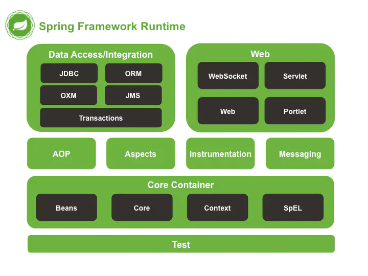

## Spring概念

### 特点

- 轻量级

> 零配置编程，API使用简单

- 面向Bean

> 只需要编写非常普通的Bean

- 松耦合

> 充分利用AOP思想

- 万能胶

> 与主流框架无缝集成

- 设计模式

> 将Java中经典的设计模式运行的彻底


### Spring采用了四个关键策略

**1.基于POJO的轻量级和最小侵入性编程；**

侵入性：代码的嵌套的使用；

独立开发合并运行减少侵入式；

**2.通过依赖注入和面向接口松耦合；**

依赖注入：以成员变量的形式把这个类的公共的代码引入像Spring的注入的方式有get，set方式， 构造方法注入；

**3.基于切面和惯性进行声明式编程；**

切面：AOP，使用的目的也是为了解耦，在Spring出现之前AOP只是一种思想，出现之后，使它变成一种现实，真正实现了代码与代码不相互嵌套，侵入，最终合在一起运行；典型的事务的管理；

**4.通过切面和模板减少样版式代码；**

像Spring jdbc, Spring mvc里面使用很多模板的概念，解决数据处理的逻辑；

像这些都是为了简化开发的；

### 面向Bean

Spring 是面向Bean的编程（Bean Oriented Programming，BOP），Bean在Spring中才是真正的主角，spring习惯叫做BOP编程

Spring里面有一个核心的**IOC容器**，主要是用来存储Bean的，保证Bean之间的依赖关系，**Spring**

**提供IOC容器通过配置文件或者注解的方式来管理对象之间的依赖关系**；

 

**控制反转**（其中最常见的方式叫做**依赖注入** （Dependency Injection，DI）,还有一种方式叫“依赖查找”

（Dependency Lookup，DL），它在C++，Java，PHP以及.NET中运用。在最早的Spring是包含有依赖注入方法和依赖查询的，但是因为依赖查询使用频率过低，不久就被Spring移除了，**所以在Spring中**

**控制反转也被称作依赖注入**），它的基本概念是：不创建对象，但是描述创建它们的方式，在代码中不直接与对象和服务连接，但在配置文件中描述哪一个组件需要哪一项服务。容器（在Spring框架中是IOC容器） 负责将这些联系在一起。

```java
class A{
    int a;
    int b;
    public void execute(){}
}
//在普通的类中，我们需要实例化之后用一个变量保存下来（或者是匿名对象）
A a = new A();
```

但是在spring中：

```java
@Autowire A a；
//Spring 初始化，实例化，现在没有new()也实例化了，也就是说这个控制权交给spring了，控制反转
```

spring创建的对象是有Spring容器来保存（也就是IOC容器），用来存储java bean对象；
与此类似的是Web容器，它是用来装Servlet的

I**OC最终的目的是实现依赖注入**

在典型的IOC场景中容器创建了所有对象，并设置必要的属性将它们连接在一起，决定什么时间调用方法

### 依赖注入

Spring 设计的核心 org.springframework.beans包（架构核心是org.springframework.core包），它设计目的是与JavaBean组件一起使用。这个包通常不是由用户直接使用，而是由服务器将其用作其他多数功能的底层中介，下一个最高级抽象是BeanFactory接口，它是工厂设计模式的实现，允许通过名称创建和检索对象。BeanFactory 也可以管理对象之间的关系。

BeanFacory支持两种对象模型，其一：单例：模型提供了具有特定名称的对象共享实例，可以在查询时对其进行检索。Signgleton是默认的也是最常见的对象模型。对于无状态服务对象很理想。其二：原型: 模型确保每次检索都会创建单独的对象，在每个用户都需要自己的对象时，原型模型最适合。

bean工厂的概念是Spring作为IOC容器的基础。IOC则将处理事情的责任从应用程序代码转移到框架。

```java
//实现依赖注入（赋值）

@Autowired Interface A a ; //自动把它的实现类注入进来

@Resource("aaa") A b ;// IOC容器中类的id为aaa对象自动注入到这里（可区分父子类）

@Autowired A a; //根据类型自动注入
```

依赖链中所有的对象，IOC容器里面初始化，实例化是按照先后顺序进行的；

Spring的注入方式

1.setter

2.构造方式

3.强制赋值 如`@Autowired private Interface A a ; //也可以自动把它的实现类注入进来`

### 面向切面

面向切面编程，即AOP，是一种编程思想，它允许程序员对横切关注点或横切典型的职责分界线的行为（例如日志和事务管理）进行模块化。AOP的核心构造是方便将哪些影响多个类的行为封装到可重用的模块中。

Aop和IOC是补充性的技术，它们都运用模块化方式解决企业应用程序开发中的复杂问题。在典型

的面向对象开发方式中，可能要将日志记录语句放在所有方法和Java类中才能实现日志功能。在AOP方式中，可以反过来将日志服务模块化，并以声明的方式将它们应用到需要日志的组件上，当然，优势就是Java类不需要知道日志服务的存在，也不需要考虑相关的代码，所以，用Spring AOP编写的用用程序代码是松耦合的；

AOP一定要达到无缝合并，否则就不叫AOP，AOP核心切面即规则目的解耦；

AOP核心思想： 实现AOP编程，先把一个整体拆开，分别开发，等到发布的时候，再组装到一起运行；拆开是要**按照一定的规则，这个规则就是切面，一个切面就是一个规则**，面向切面编程就是要怎么去定义这个规则；

总结AOP思想：**解耦**

AOP的功能完全集成到了Spring事务管理、日志和其他各种特性的上下文中。


### 常用设计模式

#### 代理模式

https://refactoringguru.cn/design-patterns/proxy

**代理模式**是一种结构型设计模式， 让你能够提供对象的替代品或其占位符。 代理控制着对于原对象的访问， 并允许在将请求提交给对象前后进行一些处理。

##### 实现方式

1. 如果没有现成的服务接口， 你就需要创建一个接口来实现代理和服务对象的可交换性。 从服务类中抽取接口并非总是可行的， 因为你需要对服务的所有客户端进行修改， 让它们使用接口。 备选计划是将代理作为服务类的子类， 这样代理就能继承服务的所有接口了。
2. 创建代理类， 其中必须包含一个存储指向服务的引用的成员变量。 通常情况下， 代理负责创建服务并对其整个生命周期进行管理。 在一些特殊情况下， 客户端会通过构造函数将服务传递给代理。
3. 根据需求实现代理方法。 在大部分情况下， 代理在完成一些任务后应将工作委派给服务对象。
4. 可以考虑新建一个构建方法来判断客户端可获取的是代理还是实际服务。 你可以在代理类中创建一个简单的静态方法， 也可以创建一个完整的工厂方法。
5. 可以考虑为服务对象实现延迟初始化。

#### 工厂方法模式

##### 实现方式

1. 让所有产品都遵循同一接口。 该接口必须声明对所有产品都有意义的方法。

2. 在创建类中添加一个空的工厂方法。 该方法的返回类型必须遵循通用的产品接口。

3. 在创建者代码中找到对于产品构造函数的所有引用。 将它们依次替换为对于工厂方法的调用， 同时将创建产品的代码移入工厂方法。 你可能需要在工厂方法中添加临时参数来控制返回的产品类型。

   工厂方法的代码看上去可能非常糟糕。 其中可能会有复杂的 `switch`分支运算符， 用于选择各种需要实例化的产品类。 但是不要担心， 我们很快就会修复这个问题。

4. 现在， 为工厂方法中的每种产品编写一个创建者子类， 然后在子类中重写工厂方法， 并将基本方法中的相关创建代码移动到工厂方法中。

5. 如果应用中的产品类型太多， 那么为每个产品创建子类并无太大必要， 这时你也可以在子类中复用基类中的控制参数。

   例如， 设想你有以下一些层次结构的类。 基类 `邮件`及其子类 `航空邮件`和 `陆路邮件` ；  `运输`及其子类 `飞机`, `卡车`和 `火车` 。  `航空邮件`仅使用 `飞机`对象， 而 `陆路邮件`则会同时使用 `卡车`和 `火车`对象。 你可以编写一个新的子类 （例如 `火车邮件` ） 来处理这两种情况， 但是还有其他可选的方案。 客户端代码可以给 `陆路邮件`类传递一个参数， 用于控制其希望获得的产品。

6. 如果代码经过上述移动后， 基础工厂方法中已经没有任何代码， 你可以将其转变为抽象类。 如果基础工厂方法中还有其他语句， 你可以将其设置为该方法的默认行为。

#### 抽象工厂模式

##### 实现方式

1. 以不同的产品类型与产品变体为维度绘制矩阵。
2. 为所有产品声明抽象产品接口。 然后让所有具体产品类实现这些接口。
3. 声明抽象工厂接口， 并且在接口中为所有抽象产品提供一组构建方法。
4. 为每种产品变体实现一个具体工厂类。
5. 在应用程序中开发初始化代码。 该代码根据应用程序配置或当前环境， 对特定具体工厂类进行初始化。 然后将该工厂对象传递给所有需要创建产品的类。
6. 找出代码中所有对产品构造函数的直接调用， 将其替换为对工厂对象中相应构建方法的调用。


#### 策略模式Strategy

##### 解决方案

策略模式建议找出负责用许多不同方式完成特定任务的类， 然后将其中的算法抽取到一组被称为*策略*的独立类中。

名为上下文的原始类必须包含一个成员变量来存储对于每种策略的引用。 上下文并不执行任务， 而是将工作委派给已连接的策略对象。

上下文不负责选择符合任务需要的算法——客户端会将所需策略传递给上下文。 实际上， 上下文并不十分了解策略， 它会通过同样的通用接口与所有策略进行交互， 而该接口只需暴露一个方法来触发所选策略中封装的算法即可。

因此， 上下文可独立于具体策略。 这样你就可在不修改上下文代码或其他策略的情况下添加新算法或修改已有算法了。

在导游应用中， 每个路线规划算法都可被抽取到只有一个 `build­Route`生成路线方法的独立类中。 该方法接收起点和终点作为参数， 并返回路线中途点的集合。

即使传递给每个路径规划类的参数一模一样， 其所创建的路线也可能完全不同。 主要导游类的主要工作是在地图上渲染一系列中途点， 不会在意如何选择算法。 该类中还有一个用于切换当前路径规划策略的方法， 因此客户端 （例如用户界面中的按钮） 可用其他策略替换当前选择的路径规划行为。


#### 原型模式Prototype


#### 模板模式


## 俯瞰Spring架构设计

### 3.1系统架构

Spring总共大约由20个模块，由1300多个不同的文件构成。而这些组件被分别整合在核心容器（Core Container）、AOP（Aspect Oriented Programming）和设备支持（Instrmentation）、数据访问及集成（Data Access/Integration）、Web、报文发送（Messaging）、Test，6个模块集合中。



