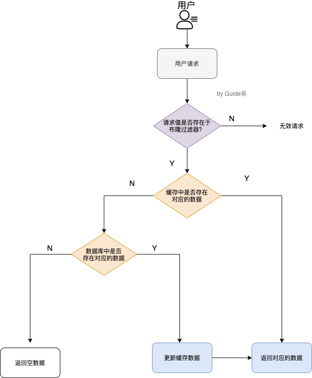

# Redis

# 为什么要用 Redis/为什么要用缓存？

**高性能：**

保证用户下一次再访问这些数据的时候就可以直接从缓存中获取了。操作缓存就是直接操作内存，所以速度相当快。

不过，要保持数据库和缓存中的数据的**一致性**。 如果数据库中的对应数据改变的之后，同步改变缓存中相应的数据即可！

**高并发：**

一般像 MySQL 这类的数据库的 QPS 大概都在 1w 左右（4 核 8g） ，但是使用 Redis 缓存之后很容易达到 10w+，甚至最高能达到 30w+（就单机 redis 的情况，redis 集群的话会更高）。

# Redis 除了做缓存，还能做什么？

-   **分布式锁** ： 通过 Redis 来做分布式锁是一种比较常见的方式。通常情况下，我们都是基于 **Redisson** 来实现分布式锁。相关阅读：[《分布式锁中的王者方案 - Redisson》open in new window](https://mp.weixin.qq.com/s/CbnPRfvq4m1sqo2uKI6qQw "《分布式锁中的王者方案 - Redisson》open in new window")。
-   **限流** ：一般是通过 Redis + Lua 脚本的方式来实现限流。相关阅读：[《我司用了 6 年的 Redis 分布式限流器，可以说是非常厉害了！》open in new window](https://mp.weixin.qq.com/s/kyFAWH3mVNJvurQDt4vchA "《我司用了 6 年的 Redis 分布式限流器，可以说是非常厉害了！》open in new window")。
-   **消息队列** ：Redis 自带的 list 数据结构可以作为一个简单的队列使用。Redis 5.0 中增加的 Stream 类型的数据结构更加适合用来做消息队列。它比较类似于 Kafka，有主题和消费组的概念，支持消息持久化以及 ACK 机制。
-   **复杂业务场景** ：通过 Redis 以及 Redis 扩展（比如 Redisson）提供的数据结构，我们可以很方便地完成很多复杂的业务场景比如通过 bitmap 统计活跃用户、通过 sorted set 维护排行榜。
-   ......

## Redis 数据结构

### Redis 常用的数据结构有哪些？

-   **5 种基础数据结构** ：String（字符串）、List（列表）、Set（集合）、Hash（散列）、Zset（有序集合）。
-   **3 种特殊数据结构** ：HyperLogLogs（基数统计）、Bitmap （位存储）、Geospatial (地理位置)。

关于 5 种基础数据结构的详细介绍请看这篇文章：[Redis 5 种基本数据结构详解](https://javaguide.cn/database/redis/redis-data-structures-01.html "Redis 5 种基本数据结构详解")。

关于 3 种特殊数据结构的详细介绍请看这篇文章：[Redis 3 种特殊数据结构详解](https://javaguide.cn/database/redis/redis-data-structures-02.html "Redis 3 种特殊数据结构详解")。

### String 还是 Hash 存储对象数据更好呢？

-   String 存储的是序列化后的对象数据，存放的是整个对象。Hash 是对对象的每个字段单独存储，可以获取部分字段的信息，也可以修改或者添加部分字段，节省网络流量。如果对象中某些字段需要经常变动或者经常需要单独查询对象中的个别字段信息，Hash 就非常适合。
-   String 存储相对来说更加节省内存，缓存相同数量的对象数据，String 消耗的内存约是 Hash 的一半。并且，存储具有多层嵌套的对象时也方便很多。如果系统对性能和资源消耗非常敏感的话，String 就非常适合。

由于购物车中的商品频繁修改和变动，这个时候 Hash 就非常适合了！

# Redis 线程模型

## Redis 单线程模型了解吗？

Redis 通过**IO 多路复用程序** 来监听来自客户端的大量连接（或者说是监听多个 socket），它会将感兴趣的事件及类型（读、写）注册到内核中并监听每个事件是否发生。

这样的好处非常明显： **I/O 多路复用技术的使用让 Redis 不需要额外创建多余的线程来监听客户端的大量连接，降低了资源的消耗**（和 NIO 中的 `Selector` 组件很像）。

另外， Redis 服务器是一个事件驱动程序，服务器需要处理两类事件：1. 文件事件; 2. 时间事件。

## Redis6.0 之前为什么不使用多线程？

我觉得主要原因有下面 3 个：

1.  单线程编程容易并且更容易维护；
2.  Redis 的性能瓶颈不在 CPU ，主要在内存和网络；
3.  多线程就会存在死锁、线程上下文切换等问题，甚至会影响性能

## Redis6.0 之后为何引入了多线程？

**Redis6.0 引入多线程主要是为了提高网络 IO 读写性能**，因为这个算是 Redis 中的一个性能瓶颈（Redis 的瓶颈主要受限于内存和网络）。

虽然，Redis6.0 引入了多线程，但是 Redis 的多线程只是在网络数据的读写这类耗时操作上使用了，**执行命令仍然是单线程顺序执行**。因此，你也不需要担心线程安全问题。

# Redis 内存管理

## Redis 给缓存数据设置过期时间有啥用？

## Redis 是如何判断数据是否过期的呢？

Redis 通过一个叫做**过期字典**（可以看作是 hash 表）来保存数据过期的时间。过期字典的键指向 Redis 数据库中的某个 key(键)，过期字典的值是一个 long long 类型的整数，这个整数保存了 key 所指向的数据库键的过期时间（毫秒精度的 UNIX 时间戳）。

## 过期的数据的删除策略了解么？

常用的过期数据的删除策略就两个（重要！自己造缓存轮子的时候需要格外考虑的东西）：

1.  **惰性删除** ：只会在取出 key 的时候才对数据进行过期检查。这样对 CPU 最友好，但是可能会造成太多过期 key 没有被删除。
2.  **定期删除** ： 每隔一段时间抽取一批 key 执行删除过期 key 操作。并且，Redis 底层会通过限制删除操作执行的时长和频率来减少删除操作对 CPU 时间的影响。

定期删除对内存更加友好，惰性删除对 CPU 更加友好。两者各有千秋，所以 Redis 采用的是 **定期删除+惰性/懒汉式删除** 。

## Redis 内存淘汰机制了解么？

1.  **volatile-lru（least recently used）**：从已设置过期时间的数据集（server.db\[i].expires）中挑选最近最少使用的数据淘汰
2.  **volatile-ttl**：从已设置过期时间的数据集（server.db\[i].expires）中挑选将要过期的数据淘汰
3.  **volatile-random**：从已设置过期时间的数据集（server.db\[i].expires）中任意选择数据淘汰
4.  **allkeys-lru（least recently used）**：当内存不足以容纳新写入数据时，在键空间中，移除最近最少使用的 key（这个是最常用的）
5.  **allkeys-random**：从数据集（server.db\[i].dict）中任意选择数据淘汰
6.  **no-eviction**：禁止驱逐数据，也就是说当内存不足以容纳新写入数据时，新写入操作会报错。这个应该没人使用吧！

4.0 版本后增加以下两种：

1.  **volatile-lfu（least frequently used）**：从已设置过期时间的数据集（server.db\[i].expires）中挑选最不经常使用的数据淘汰
2.  **allkeys-lfu（least frequently used）**：当内存不足以容纳新写入数据时，在键空间中，移除最不经常使用的 key

# Redis 持久化机制

### 怎么保证 Redis 挂掉之后再重启数据可以进行恢复？

Redis 支持持久化，而且支持两种不同的持久化操作。

**Redis 的一种持久化方式叫快照（snapshotting，RDB），**

**另一种方式是只追加文件（append-only file, AOF）**。

### 什么是 RDB 持久化？

Redis 可以通过创建快照来获得存储在内存里面的数据在某个时间点上的副本。Redis 创建快照之后，可以对快照进行备份，可以将快照复制到其他服务器从而创建具有相同数据的服务器副本（Redis 主从结构，主要用来提高 Redis 性能），还可以将快照留在原地以便重启服务器的时候使用。

**快照持久化是 Redis 默认采用的持久化方式**

### 什么是 AOF 持久化？

与快照持久化相比，AOF 持久化的实时性更好，因此已成为主流的持久化方案。默认情况下 Redis 没有开启 AOF（append only file）方式的持久化，可以通过 appendonly 参数开启

在 Redis 的配置文件中存在三种不同的 AOF 持久化方式

```bash
appendfsync always    #每次有数据修改发生时都会写入AOF文件,这样会严重降低Redis的速度
appendfsync everysec  #每秒钟同步一次，显式地将多个写命令同步到硬盘
appendfsync no        #让操作系统决定何时进行同步
```

### Redis 4.0 对于持久化机制做了什么优化？

Redis 4.0 开始支持 RDB 和 AOF 的混合持久化（默认关闭，可以通过配置项 `aof-use-rdb-preamble` 开启）。

# Redis 事务

## 如何使用 Redis 事务？

使用 [MULTI](https://redis.io/commands/multi "MULTI")命令后可以输入多个命令。Redis 不会立即执行这些命令，而是将它们放到队列，当调用了 [EXEC](https://redis.io/commands/exec "EXEC") 命令将执行所有命令。

这个过程是这样的：

1.  开始事务（`MULTI`）。
2.  命令入队(批量操作 Redis 的命令，先进先出（FIFO）的顺序执行)。
3.  执行事务(`EXEC`)。

## Redis 支持原子性吗？

Redis 的事务和我们平时理解的关系型数据库的事务不同。

我们知道事务具有四大特性： **1. 原子性**，**2. 隔离性**，**3. 持久性**，**4. 一致性**。

1.  **原子性（Atomicity）：** 事务是最小的执行单位，不允许分割。事务的原子性确保动作要么全部完成，要么完全不起作用；
2.  **隔离性（Isolation）：** 并发访问数据库时，一个用户的事务不被其他事务所干扰，各并发事务之间数据库是独立的；
3.  **持久性（Durability）：** 一个事务被提交之后。它对数据库中数据的改变是持久的，即使数据库发生故障也不应该对其有任何影响。
4.  **一致性（Consistency）：** 执行事务前后，数据保持一致，多个事务对同一个数据读取的结果是相同的；

Redis 事务在运行错误的情况下，除了执行过程中出现错误的命令外，其他命令都能正常执行。

并且，Redis 是**不支持回滚**（roll back）操作的。因此，Redis 事务其实是**不满足原子性**的（而且不满足持久性）。

## 如何解决 Redis 事务的缺陷？

一段 Lua 脚本可以视作一条命令执行，一段 Lua 脚本执行过程中不会有其他脚本或 Redis 命令同时执行，保证了操作不会被其他指令插入或打扰。

另外，Redis 7.0 新增了 [Redis functions](https://redis.io/docs/manual/programmability/functions-intro/ "Redis functions")特性，你可以将 Redis functions 看作是比 Lua 更强大的脚本。

# Redis 性能优化

## Redis bigkey

### 什么是 bigkey？

简单来说，如果一个 key 对应的 value 所占用的内存比较大，那这个 key 就可以看作是 bigkey。具体多大才算大呢？有一个不是特别精确的参考标准：string 类型的 value 超过 10 kb，复合类型的 value 包含的元素超过 5000 个（对于复合类型的 value 来说，不一定包含的元素越多，占用的内存就越多）。

### bigkey 有什么危害？

除了会消耗更多的内存空间，bigkey 对性能也会有比较大的影响。

因此，我们应该尽量避免写入 bigkey！

### 如何发现 bigkey？

**1、使用 Redis 自带的 ****`--bigkeys`**** 参数来查找。**

**2、分析 RDB 文件，** 通过分析 RDB 文件来找出 big key。

### 大量 key 集中过期问题

我在上面提到过：对于过期 key，Redis 采用的是 **定期删除+惰性/懒汉式删除** 策略。

定期删除执行过程中，如果突然遇到大量过期 key 的话，客户端请求必须等待定期清理过期 key 任务线程执行完成，因为这个这个定期任务线程是在 Redis 主线程中执行的。这就导致客户端请求没办法被及时处理，响应速度会比较慢。

如何解决呢？下面是两种常见的方法：

1.  给 key 设置随机过期时间。
2.  开启 lazy-free（惰性删除/延迟释放） 。lazy-free 特性是 Redis 4.0 开始引入的，指的是让 Redis 采用异步方式延迟释放 key 使用的内存，将该操作交给单独的子线程处理，避免阻塞主线程。

个人建议不管是否开启 lazy-free，我们都尽量给 key 设置随机过期时间。

# Redis 生产问题

## 缓存穿透

大量请求的 key 根本不存在于缓存中，导致请求直接到了数据库上，根本没有经过缓存这一层。

### 解决办法

最基本的就是首先做好参数校验，一些不合法的参数请求直接抛出异常信息返回给客户端。比如查询的数据库 id 不能小于 0、传入的邮箱格式不对的时候直接返回错误消息给客户端等等。

**1）缓存无效 key**

如果缓存和数据库都查不到某个 key 的数据就写一个到 Redis 中去并设置过期时间。

一般情况下我们是这样设计 key 的： `表名:列名:主键名:主键值` 。

**2）布隆过滤器**

布隆过滤器是一个非常神奇的数据结构，通过它我们可以非常方便地判断一个给定数据是否存在于海量数据中。

具体是这样做的：**把所有可能存在的请求的值都存放在布隆过滤器中，当用户请求过来，先判断用户发来的请求的值是否存在于布隆过滤器中。不存在的话，直接返回请求参数错误信息给客户端，存在的话才会走下面的流程。**


但是，需要注意的是布隆过滤器可能会存在误判的情况。总结来说就是： **布隆过滤器说某个元素存在，小概率会误判。布隆过滤器说某个元素不在，那么这个元素一定不在。**

## 缓存雪崩

**缓存在同一时间大面积的失效，后面的请求都直接落到了数据库上，造成数据库短时间内承受大量请求。**

**有一些被大量访问数据（热点缓存）在某一时刻大面积失效，导致对应的请求直接落到了数据库上。**

### 解决办法？

**针对 Redis 服务不可用的情况：**

1.  采用 Redis 集群，避免单机出现问题整个缓存服务都没办法使用。
2.  限流，避免同时处理大量的请求。

**针对热点缓存失效的情况：**

1.  设置不同的失效时间比如随机设置缓存的失效时间。
2.  缓存永不失效。

## 如何保证缓存和数据库数据的一致性？

细说的话可以扯很多，但是我觉得其实没太大必要（小声 BB：很多解决方案我也没太弄明白）。我个人觉得引入缓存之后，如果为了短时间的不一致性问题，选择让系统设计变得更加复杂的话，完全没必要。

下面单独对 **Cache Aside Pattern（旁路缓存模式）** 来聊聊。

Cache Aside Pattern 中遇到写请求是这样的：更新 DB，然后直接删除 cache 。

如果更新数据库成功，而删除缓存这一步失败的情况的话，简单说两个解决方案：

1.  **缓存失效时间变短（不推荐，治标不治本）** ：我们让缓存数据的过期时间变短，这样的话缓存就会从数据库中加载数据。另外，这种解决办法对于先操作缓存后操作数据库的场景不适用。
2.  **增加 cache 更新重试机制（常用）**： 如果 cache 服务当前不可用导致缓存删除失败的话，我们就隔一段时间进行重试，重试次数可以自己定。如果多次重试还是失败的话，我们可以把当前更新失败的 key 存入队列中，等缓存服务可用之后，再将缓存中对应的 key 删除即可。

[缓存和数据库一致性问题，看这篇就够了](https://mp.weixin.qq.com/s?__biz=MzIyOTYxNDI5OA==&mid=2247487312&idx=1&sn=fa19566f5729d6598155b5c676eee62d&chksm=e8beb8e5dfc931f3e35655da9da0b61c79f2843101c130cf38996446975014f958a6481aacf1&scene=178&cur_album_id=1699766580538032128#rd)

# 3种常用的缓存读写策略

## Cache Aside Pattern（旁路缓存模式）

比较适合读请求比较多的场景

**写** ：

-   先更新 DB
-   然后直接删除 cache 。

简单画了一张图帮助大家理解写的步骤。


**读** :

-   从 cache 中读取数据，读取到就直接返回
-   cache中读取不到的话，就从 DB 中读取数据返回
-   再把数据放到 cache 中。

简单画了一张图帮助大家理解读的步骤。


比如说面试官很可能会追问：“**在写数据的过程中，可以先删除 cache ，后更新 DB 么？**”

**答案：** 那肯定是不行的！因为这样可能会造成**数据库（DB）和缓存（Cache）数据不一致**的问题。为什么呢？比如说请求1 先写数据A，请求2随后读数据A的话就很有可能产生数据不一致性的问题。

面试官可能会紧接着就追问：“**在写数据的过程中，先更新DB，后删除cache就没有问题了么？**”

**答案：** 理论上来说还是可能会出现数据不一致性的问题，不过概率非常小，因为缓存的写入速度是比数据库的写入速度快很多！

比如请求1先读数据 A，请求2随后写数据A，并且数据A不在缓存中的话也有可能产生数据不一致性的问题。

### 缺陷

**缺陷1：首次请求数据一定不在 cache 的问题**

解决办法：可以将热点数据可以提前放入cache 中。

**缺陷2：写操作比较频繁的话导致cache中的数据会被频繁被删除，这样会影响缓存命中率 。**

解决办法：

-   数据库和缓存数据强一致场景 ：更新DB的时候同样更新cache，不过我们需要加一个锁/分布式锁来保证更新cache的时候不存在线程安全问题。
-   可以短暂地允许数据库和缓存数据不一致的场景 ：更新DB的时候同样更新cache，但是给缓存加一个比较短的过期时间，这样的话就可以保证即使数据不一致的话影响也比较小。

## Read/Write Through Pattern（读写穿透）

Read/Write Through Pattern 中服务端把 cache 视为主要数据存储，从中读取数据并将数据写入其中。cache 服务负责将此数据读取和写入 DB，从而减轻了应用程序的职责。

这种缓存读写策略小伙伴们应该也发现了在平时在开发过程中非常少见。抛去性能方面的影响，大概率是因为我们经常使用的分布式缓存 Redis 并没有提供 cache 将数据写入DB的功能。

**写（Write Through）：**

-   先查 cache，cache 中不存在，直接更新 DB。
-   cache 中存在，则先更新 cache，然后 cache 服务自己更新 DB（**同步更新 cache 和 DB**）。

简单画了一张图帮助大家理解写的步骤。


**读(Read Through)：**

-   从 cache 中读取数据，读取到就直接返回 。
-   读取不到的话，先从 DB 加载，写入到 cache 后返回响应。

简单画了一张图帮助大家理解读的步骤。


Read-Through Pattern 实际只是在 Cache-Aside Pattern 之上进行了封装。在 Cache-Aside Pattern 下，发生读请求的时候，如果 cache 中不存在对应的数据，是由客户端自己负责把数据写入 cache，而 Read-Through Pattern 则是 cache 服务自己来写入缓存的，这对客户端是透明的。

和 Cache Aside Pattern 一样， Read-Through Pattern 也有首次请求数据一定不再 cache 的问题，对于热点数据可以提前放入缓存中。

## Write Behind Pattern（异步缓存写入）

Write Behind Pattern 和 Read/Write Through Pattern 很相似，两者都是由 cache 服务来负责 cache 和 DB 的读写。

但是，两个又有很大的不同：**Read/Write Through 是同步更新 cache 和 DB，而 Write Behind Caching 则是只更新缓存，不直接更新 DB，而是改为异步批量的方式来更新 DB。**

很明显，这种方式对数据一致性带来了更大的挑战，比如cache数据可能还没异步更新DB的话，cache服务可能就就挂掉了。

这种策略在我们平时开发过程中也非常非常少见，但是不代表它的应用场景少，比如消息队列中消息的异步写入磁盘、MySQL 的 InnoDB Buffer Pool 机制都用到了这种策略。

Write Behind Pattern 下 DB 的写性能非常高，非常适合一些数据经常变化又对数据一致性要求没那么高的场景，比如浏览量、点赞量。
