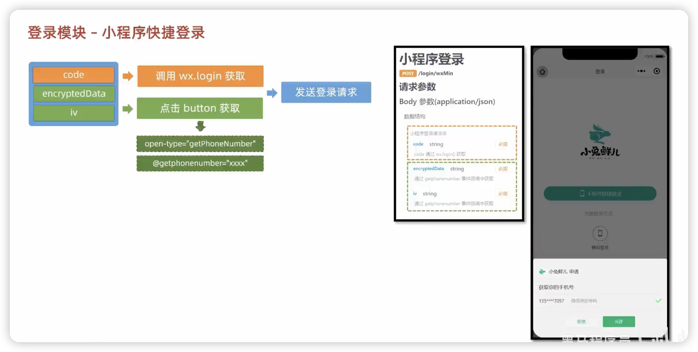
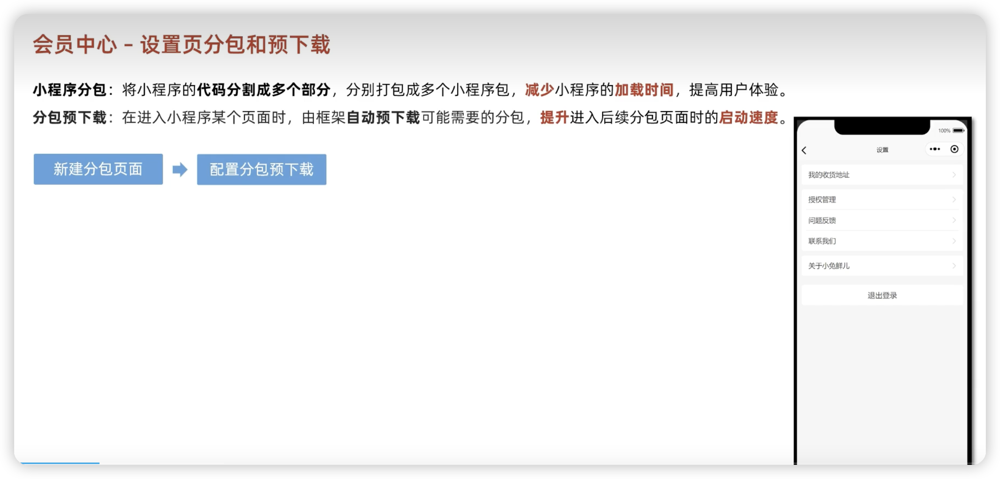

# 前端学习-黑马 uniapp 小兔鲜儿微信小程序 Vue3+Ts+Pinia

https://www.bilibili.com/video/BV1Bp4y1379L

## uniapp 与原生小程序开发的区别


## Corepack、nvm、npm、yarn、pnpm 包管理工具之间的区别

nvm 是 Mac 下的 node 管理工具

Corepack 是一个实验性工具，在 Node.js v16.13 版本中引入，它可以指定项目使用的包管理器以及版本, 简单来说，Corepack 会成为 Node.js 官方的内置 CLI，用来管理『包管理工具（npm、yarn、pnpm、cnpm）』，用户无需手动安装，即『包管理器的管理器』

npm 初始默认管理器

yarn 升级的管理器，npm 的升级替代品；Yarn 缓存了每个下载过的包，所以再次使用时无需重复下载，同时利用并行下载以最大化资源利用率，因此安装速度更快

cnpm 这个是国内淘宝镜像，是为解决 npm 速度太慢的问题而产生的，控制台 log 也清晰许多,但是它最大的问题是会忽视 package-lock.json 文件，也就是说 你无法锁定小版本，可能会导致依赖版本不一致引起的 bug，防止这个隐患则需要在 package.json 中就锁定版本

pnpm （新一代包管理工具）：所有文件都会存储在硬盘上的某一位置。 当软件包被被安装时，包里的文件会硬链接到这一位置，而不会占用额外的磁盘空间。这允许你跨项目地共享同一版本的依赖,因此，您在磁盘上节省了大量空间，这与项目和依赖项的数量成正比，并且安装速度要快得多。

## 创建项目

通过 hbuilderx 创建
通过命令行

## HBuilderX 下创建的项目和 cli 创建的项目的区别

cli 创建的项目，编译器安装在项目下。并且不会跟随 HBuilderX 升级。
HBuilderX 可视化界面创建的项目，编译器在 HBuilderX 的安装目录下的 plugin 目录，随着 HBuilderX 的升级会自动升级编译器。
已经使用 cli 创建的项目，如果想继续在 HBuilderX 里使用，可以把工程拖到 HBuilderX 中。
cli 版如果想安装 less、scss、ts 等编译器，需自己手动 npm 安装。在 HBuilderX 的插件管理界面安装无效，那个只作用于 HBuilderX 创建的项目。

## 用 vscode 开发 uniapp

1. 安装插件
2. ts 类型校验
3. 设置-》文件关联，允许 json 注释问题

## 基础架构

### 安装 uni-ui 组件库

### pinia 持久化

```js
{
    // 网页端配置
    // persist: true,
    // 小程序端配置
    persist: {
      storage: {
        getItem(key) {
          return uni.getStorageSync(key)
        },
        setItem(key, value) {
          uni.setStorageSync(key, value)
        },
      },
    },
  }
```

### 请求和上传文件拦截器

`http.ts`文件

```js
/**
 * 添加拦截器:
 *   拦截 request 请求
 *   拦截 uploadFile 文件上传
 *
 * TODO:
 *   1. 非 http 开头需拼接地址
 *   2. 请求超时
 *   3. 添加小程序端请求头标识
 *   4. 添加 token 请求头标识
 */

import { useMemberStore } from "@/stores";

const baseURL = "https://pcapi-xiaotuxian-front-devtest.itheima.net";

// 添加拦截器
const httpInterceptor = {
  // 拦截前触发
  invoke(options: UniApp.RequestOptions) {
    // 1. 非 http 开头需拼接地址
    if (!options.url.startsWith("http")) {
      options.url = baseURL + options.url;
    }
    // 2. 请求超时, 默认 60s
    options.timeout = 10000;
    // 3. 添加小程序端请求头标识
    options.header = {
      ...options.header,
      "source-client": "miniapp",
    };
    // 4. 添加 token 请求头标识
    const memberStore = useMemberStore();
    const token = memberStore.profile?.token;
    if (token) {
      options.header.Authorization = token;
    }
  },
};
uni.addInterceptor("request", httpInterceptor);
uni.addInterceptor("uploadFile", httpInterceptor);
```

### 封装 Promise 请求函数

借鉴 axios

```js

/**
 * 请求函数
 * @param  UniApp.RequestOptions
 * @returns Promise
 *  1. 返回 Promise 对象
 *  2. 获取数据成功
 *    2.1 提取核心数据 res.data
 *    2.2 添加类型，支持泛型
 *  3. 获取数据失败
 *    3.1 401错误  -> 清理用户信息，跳转到登录页
 *    3.2 其他错误 -> 根据后端错误信息轻提示
 *    3.3 网络错误 -> 提示用户换网络
 */
type Data<T> = {
  code: string
  msg: string
  result: T
}
// 2.2 添加类型，支持泛型
export const http = <T>(options: UniApp.RequestOptions) => {
  // 1. 返回 Promise 对象
  return new Promise<Data<T>>((resolve, reject) => {
    uni.request({
      ...options,
      // 响应成功
      success(res) {
        // 状态码 2xx， axios 就是这样设计的
        if (res.statusCode >= 200 && res.statusCode < 300) {
          // 2.1 提取核心数据 res.data
          resolve(res.data as Data<T>)
        } else if (res.statusCode === 401) {
          // 401错误  -> 清理用户信息，跳转到登录页
          const memberStore = useMemberStore()
          memberStore.clearProfile()
          uni.navigateTo({ url: '/pages/login/login' })
          reject(res)
        } else {
          // 其他错误 -> 根据后端错误信息轻提示
          uni.showToast({
            icon: 'none',
            title: (res.data as Data<T>).msg || '请求错误',
          })
          reject(res)
        }
      },
      // 响应失败
      fail(err) {
        uni.showToast({
          icon: 'none',
          title: '网络错误，换个网络试试',
        })
        reject(err)
      },
    })
  })
}
```

## 首页

### 自定义导航栏

准备组件
隐藏默认导航栏 pages.json

```js
 {
      "path": "pages/index/index",
      "style": {
        "navigationStyle": "custom",
        "navigationBarTextStyle": "white",
        "navigationBarTitleText": "首页"
      }
    },
```

不同手机样式适配--安全区域

```js
// 获取屏幕边界到安全区域距离
const { safeAreaInsets } = uni.getSystemInfoSync();
```

### 轮播组件

#### 组件

准备组件 XtxSwiper.vue
自动导入组件

```js
"easycom": {
    "autoscan": true,
    "custom": {
      // uni-ui 规则如下配置
      "^uni-(.*)": "@dcloudio/uni-ui/lib/uni-$1/uni-$1.vue",
      // 以 Xtx 开头的组件，在 components 文件夹中查找引入（需要重启服务器）
      "^Xtx(.*)": "@/components/Xtx$1.vue"
    }
  },
```

添加组件类型说明

#### 指示点

```js
const activeIndex = ref(0)

// 当 swiper 下标发生变化时触发
const onChange: UniHelper.SwiperOnChange = (ev) => {
  activeIndex.value = ev.detail!.current
}
```

#### 获取轮播图数据 api

```js
// 获取轮播图数据
const bannerList = ref<BannerItem[]>([])
const getHomeBannerData = async () => {
  const res = await getHomeBannerAPI()
  bannerList.value = res.result
}

// 是否加载中标记
const isLoading = ref(false)

// 页面加载
onLoad(async () => {
  isLoading.value = true
  await Promise.all([getHomeBannerData()])
  isLoading.value = false
})
```

```js
/**
 * 首页-广告区域-小程序
 * @param distributionSite 广告区域展示位置（投放位置 投放位置，1为首页，2为分类商品页） 默认是1
 */
export const getHomeBannerAPI = (distributionSite = 1) => {
  return http<BannerItem[]>({
    method: 'GET',
    url: '/home/banner',
    data: {
      distributionSite,
    },
  })
}
```

#### 构造轮播图数据类型并渲染

1. 定义轮播图数据类型
2. 指定类型并传值给子组件
3. 渲染轮播图数据

### 前台分类组件

准备组件，只有首页使用
导入使用组件
设置首页底色

CategoryPanel.vue

#### 获取前台分类数据

```js
// 获取前台分类数据
const categoryList = ref<CategoryItem[]>([])
const getHomeCategoryData = async () => {
  const res = await getHomeCategoryAPI()
  categoryList.value = res.result
}
```

#### 前台获取分类数据模型并且渲染

### 首页-热门推荐

```js
/**
 * 首页-热门推荐-小程序
 */
export const getHomeHotAPI = () => {
  return http<HotItem[]>({
    method: 'GET',
    url: '/home/hot/mutli',
  })
}

// 获取热门推荐数据
const hotList = ref<HotItem[]>([])
const getHomeHotData = async () => {
  const res = await getHomeHotAPI()
  hotList.value = res.result
}
```

### 首页-猜你喜欢

#### 组件封装

组件封装成 通用组件 XtxGuess.vue
准备`scroll-view`滚动容器
设置 page 和 scroll-view 样式，除了导航栏固定其他都放在容器内

#### 获取数据，数据类型，列表渲染

封装 API
组件生命周期-》组件挂载完毕

猜你喜欢分页，滚动触底加载，父调子
模板 ref 父

分页加载

```js
// 分页参数
const pageParams: Required<PageParams> = {
  page: 1,
  pageSize: 10,
}
// 猜你喜欢的列表
const guessList = ref<GuessItem[]>([])
// 已结束标记
const finish = ref(false)
// 获取猜你喜欢数据
const getHomeGoodsGuessLikeData = async () => {
  // 退出分页判断
  if (finish.value === true) {
    return uni.showToast({ icon: 'none', title: '没有更多数据~' })
  }
  const res = await getHomeGoodsGuessLikeAPI(pageParams)
  // guessList.value = res.result.items
  // 数组追加
  guessList.value.push(...res.result.items)
  // 分页条件
  if (pageParams.page < res.result.pages) {
    // 页码累加
    pageParams.page++
  } else {
    finish.value = true
  }
}
```

### 首页--下拉刷新

滚动容器-开启下拉刷新-监听事件-加载数据-关闭动画
猜你喜欢组件 父调子 重置页码，列表，结束标记

```js
  <scroll-view
      class="scroll-view"
      refresher-enabled
      @refresherrefresh="onRefresherrefresh"
      :refresher-triggered="isTriggered"
      @scrolltolower="onScrolltolower"
      scroll-y
    />
```

```js
// 重置数据
const resetData = () => {
  pageParams.page = 1;
  guessList.value = [];
  finish.value = false;
};
```

### 首页--骨架屏

缓解用户焦虑等

微信开发者工具-生成骨架屏-转成 vue 组件-数据正在加载中显示骨架屏

```js
<PageSkeleton v-if="isLoading" />
```

## 热门推荐

新建页面-静态结构-跳转页面传参-获取页面参数-动态设置标题
封装通用接口-初始化调用-定义类型-渲染页面-Tab 交互
滚动触底-获取当前选项-当前页码累加-调用 AP 传参-当前数组追加

```ts
// 滚动触底
const onScrolltolower = async () => {
  // 获取当前选项
  const currsubTypes = subTypes.value[activeIndex.value];
  // 分页条件
  if (currsubTypes.goodsItems.page < currsubTypes.goodsItems.pages) {
    // 当前页码累加
    currsubTypes.goodsItems.page++;
  } else {
    // 标记已结束
    currsubTypes.finish = true;
    // 退出并轻提示
    return uni.showToast({ icon: "none", title: "没有更多数据了~" });
  }

  // 调用API传参
  const res = await getHotRecommendAPI(currUrlMap!.url, {
    subType: currsubTypes.id,
    page: currsubTypes.goodsItems.page,
    pageSize: currsubTypes.goodsItems.pageSize,
  });
  // 新的列表选项
  const newsubTypes = res.result.subTypes[activeIndex.value];
  // 数组追加
  currsubTypes.goodsItems.items.push(...newsubTypes.goodsItems.items);
};
```

分页条件-页码小余总页数，页码累加-页码大于等于总页数，标记结束，推出并轻微的提示，页面底部提示

```ts
// 分页条件
if (currsubTypes.goodsItems.page < currsubTypes.goodsItems.pages) {
  // 当前页码累加
  currsubTypes.goodsItems.page++;
} else {
  // 标记已结束
  currsubTypes.finish = true;
  // 退出并轻提示
  return uni.showToast({ icon: "none", title: "没有更多数据了~" });
}
```

## 商品分类

轮播图（复用）

- 静态结构-获取轮播图数据-渲染轮播图

渲染一级分类和 tab 交互

- 封装 API-初始化调用-定义类型-渲染一级分类-tab 交互

二级分类和商品渲染

- 提取当前二级分类数据-渲染二级分类-渲染商品

快速生成骨架屏

- 微信开发者工具-生成骨架屏-调整为 vue 组件-数据未加载显示骨架屏

```ts
<view class="viewport" v-if="isFinish">...</view>
<PageSkeleton v-else />
```

## 商品详情

准备

- 新建页面-静态结构-页面参数处理-封装 API 接口-初始化调用

页面渲染

- 封装 API 接口-初始化调用-定义类型-页面渲染

轮播图交互

- 轮播图变化-更新下标
- 点击图片-大图预览

**弹出层**

- uni-ui 弹出层租金啊-设置弹出层属性-打开/关闭弹出层

弹出层交互

- 组件静态结构-条件渲染弹出层-关闭弹出层

## 登录模块

### 小程序快捷登录



不用页面渲染得数据不用写成响应式

```ts
// 获取 code 登录凭证
let code = "";
onLoad(async () => {
  const res = await wx.login();
  code = res.code;
});
// 获取用户手机号码
const onGetphonenumber: UniHelper.ButtonOnGetphonenumber = async (ev) => {
  const { encryptedData, iv } = ev.detail;
  // const res = await postLoginWxMinAPI({ code, encryptedData, iv })
};
```

注意：获取手机号功能针对非个人开发者，且完成认证的小程序开放

工作场景：使用企业小程序 appid，且把微信号添加到开发者列表中

### 模拟快捷登录

封装模拟登录 API-调用模拟登录

```ts
// 模拟手机号码快捷登录（开发练习）
const onGetphonenumberSimple = async () => {
  const res = await postLoginWxMinSimpleAPI("18158510899");
  console.log(res);
  uni.showToast({ icon: "none", title: "登录成功" });
};
```

### 保存登录信息

- 类型声明-状态管理-成功提示-页面跳转

新建 `member.t.s`,使用 stores 里面的`defineStore`

```ts
import { useMemberStore } from "@/stores";

const loginSuccess = (profile: LoginResult) => {
  // 保存会员信息
  const memberStore = useMemberStore();
  memberStore.setProfile(profile);
  // 成功提示
  uni.showToast({ icon: "success", title: "登录成功" });
  setTimeout(() => {
    // 页面跳转
    uni.switchTab({ url: "/pages/my/my" });
    // uni.navigateBack()
  }, 500);
};
```

## 会员中心

### 会员信息展示

- 静态结构-自定义导航-渲染会员信息

### 猜你喜欢分页加载

获取组件实例-滚动触底事件-加载分页数据-》封装组合式函数

```ts
import type { XtxGuessInstance } from "@/types/component";
import { ref } from "vue";

/**
 * 猜你喜欢组合式函数
 */
export const useGuessList = () => {
  // 获取猜你喜欢组件实例
  const guessRef = ref<XtxGuessInstance>();

  // 滚动触底事件
  const onScrolltolower = () => {
    guessRef.value?.getMore();
  };

  // 返回 ref 和事件处理函数
  return {
    guessRef,
    onScrolltolower,
  };
};
```

### 设置页分包和预下载



pages.json

```ts
{
// 分包加载规则
  "subPackages": [
    {
      // 子包的根目录
      "root": "pagesMember",
      // 页面路径和窗口表现
      "pages": [
        {
          "path": "settings/settings",
          "style": {
            "navigationBarTitleText": "设置"
          }
        }
      ]
    }
  ],
  // 分包预下载规则
  "preloadRule": {
    "pages/my/my": {
      "network": "all",
      "packages": ["pagesMember"]
    }
  }
}
```

### 退出登录
- 显示模态弹窗-确认退出-清理用户信息-返回上一页-内容条件渲染

