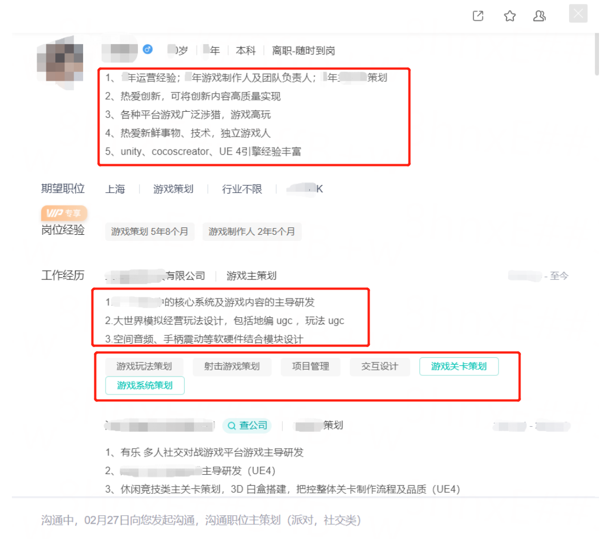
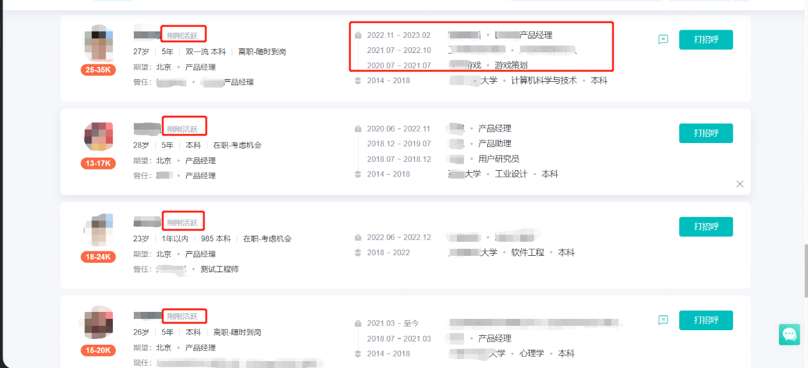

# 面经

## 一位 HR 分享的求职建议，挺不错的，分享一下

很多同学可能都觉得自己很难找到工作，这里我从网站HR招聘端口给到大家一些小建议。
1、一般情况下，HR都在9点左右上班，上班第一件事情就是筛负责岗位的简历，注意每个候选人都会有个活跃度的显示，所以在大家每天早上醒来登录一下招聘网站提升自己的活跃度会有效增加自己的曝光量，让自己在相关岗位的展示更加靠前；

2、一般招聘网站的展示条大概可以显示你们的最近2-3段工作经历，大家一定要写清楚这部分，不要想着自己准备了附件简历这里就偷懒不写，HR对大家最直观的了解大部分来自于这里，如果不匹配这里大概率就会被刷掉了；

3、有些想转行的同学，简历中尽量加一段对想换的岗位自己理解描述，甚至优势，不然大概率都是在第一轮筛选中结束；

4、打开简历如图二，概述部分大家可以用尽可能精炼的语言概括自己的工作经历，如果能够加入数据支撑会让HR更快看到你的亮点；

3、工作经历大家也尽可能分点概述，不要一段式或者三段式；

5、擅用标签功能，给自己每段经历选择合适的标签，可能会影响自己被推荐的效果；

